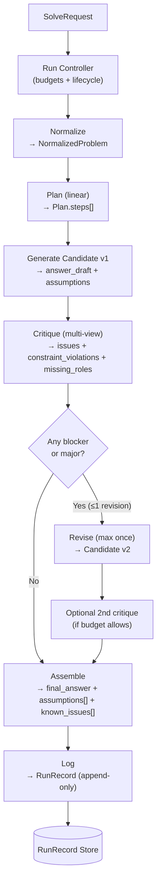

# MVP Brief — Bounded Critique‑Led Solver (V0)

**Version:** 0.3  
**Status:** Developer handoff (behavioral contract)  
**Date:** 2026-01-12  
**Owner:** Product / Engineering  
**Primary intent:** **Coverage + debuggability + learning signal** under bounded iteration (speed is a constraint, not the goal).

---

## 0) How to read this document (important)

This brief specifies **required system behavior and non‑negotiable invariants**, **not** a prescribed implementation.  
The engineer is free to choose internal architecture, frameworks, agent patterns, and storage technologies, provided:

- All **System Invariants** in §6 hold.
- The lifecycle in §3 is implemented (functionally equivalent is fine).
- The MVP **non‑goals** in §2.2 are respected.
- The system produces complete **RunRecords** per §5.

If there is any conflict between “move fast” and “invariants,” **invariants win**.

---

## 1) Executive summary

We are building an MVP **problem‑solving pipeline** that produces:

- a **candidate solution**
- a **multi‑view critique**
- **explicit assumptions** and **known issues**
- **traceability artifacts** for debugging and future evaluation

The MVP uses a simple, reproducible lifecycle:

> **Normalize → Plan (linear) → Generate → Critique (multi‑view) → (Optional single revision) → Assemble → Log**

### System flow diagram (MVP V0)

### What the MVP optimizes for (in order)

1. **Coverage & explicit uncertainty:** ensure key viewpoints and missing information are surfaced.
2. **Debuggability:** every run is inspectable via RunRecord artifacts.
3. **Measurable learning:** outputs and critiques are structured enough to drive later metrics and regression control.
4. **Cost/latency discipline:** bounded iteration and budgets prevent runaway loops (speed is a constraint).

This MVP is designed to evolve additively into the target governed multi‑agent system (evaluation ledger, regression guard, policy/tool gateway, version registry) without a rewrite.

---

## 2) Goals and non‑goals

### 2.1 MVP goals (what success means)

1. **Multi‑view critique on every run:** the system explicitly checks for coverage gaps (roles/viewpoints).
2. **Bounded iteration:** at most **one** revision pass; bounded model call budget.
3. **Transparency:** every response includes `assumptions[]` and `known_issues[]`.
4. **Traceability:** every run persists a RunRecord with intermediate artifacts and provenance metadata.
5. **Forward compatibility:** maintain seams: generation vs evaluation, structured artifacts, versioned config.

### 2.2 Non‑goals (explicitly out of scope for MVP)

- **No enterprise governance:** no policy engine, data classification workflows, approval chains.
- **No enforced regression guard:** no “must not get worse” blocking.
- **No complex task graphs:** planning is linear; no branching blackboard.
- **No external tool gateway** (web/code/db) unless later enabled behind a feature flag.
- **No long‑running jobs:** synchronous request/response only.

---

## 3) System behavior (functional contract)

### 3.1 Input

**SolveRequest**
- `prompt` (required): user request
- `constraints` (optional): hard requirements (format, tone, length, must/must‑not)
- `output_format` (optional): e.g., “markdown”, “JSON”, “bullet list”
- `context` (optional): any relevant facts/environment constraints

**MVP rule:** Proceed best‑effort; do not block on completeness.

### 3.2 Output

**SolveResponse**
- `final_answer`: user‑facing output in the requested format
- `assumptions[]`: explicit assumptions made
- `known_issues[]`: limitations/uncertainties/clarifications needed
- `run_id`: identifier for traceability

**Visibility default:** Append a short “Assumptions / Known issues” footer to `final_answer` (configurable).

### 3.3 Run lifecycle (state machine)

1. **Normalize**
   - Convert SolveRequest → `NormalizedProblem` with:
     - `problem_statement`, `constraints[]`, `output_spec`, `context`
   - **Must not silently drop constraints.** Ambiguity becomes assumptions/known issues.

2. **Plan (linear)**
   - Produce a minimal ordered `Plan.steps[]`.
   - Planning is *structuring*, not deep decomposition.

3. **Generate (Candidate v1)**
   - Generator outputs `Candidate`:
     - `answer_draft`
     - `assumptions[]`
     - `uncertainty_flags[]` (optional)

4. **Critique (multi‑view)**
   - Critic outputs `Critique` with:
     - `issues[]` each: `role`, `severity` ∈ {blocker, major, minor}, `description`, `suggested_fix`
     - `constraint_violations[]`
     - `missing_roles[]` (or role‑coverage section)
   - Multi‑view critique should cover (at minimum): requirements/scope, architecture, risk, compliance(high‑level), security/ops, evaluation/experimentation.

5. **Revise (optional, max once)**
   - If critique contains any **blocker** or **major**:
     - Run one revision pass to produce `Candidate v2`.
     - Optional second critique on v2 if budget allows.

6. **Assemble**
   - Produce `final_answer` per output_spec.
   - Ensure assumptions and known_issues are present in the payload.

7. **Log**
   - Persist a `RunRecord` with inputs, artifacts, provenance metadata, and errors/warnings.

**Hard constraints**
- **≤ 1** revision loop
- Enforce configurable **model call cap**
- Best‑effort response on failures (timeout/parse/provider) with logged incident

---

## 4) MVP components (responsibilities, not implementation)

1. API/CLI Interface  
2. Run Controller (budgets + lifecycle)  
3. Normalizer  
4. Planner (linear)  
5. LLM Client abstraction (timeouts/retries/telemetry)  
6. Generator (structured output preferred)  
7. Critic (multi‑view structured output preferred)  
8. Assembler/Formatter  
9. Persistence (append‑only RunRecords)  
10. Config (prompts, models, budgets, feature flags, versions)

---

## 5) Data contracts (MVP‑stable)

**SolveRequest**
- `prompt: string`
- `constraints?: string[]`
- `output_format?: string`
- `context?: object | string`

**NormalizedProblem**
- `problem_statement: string`
- `constraints: string[]`
- `output_spec: string`
- `context: object | string`

**Plan**
- `steps: string[]`

**Candidate**
- `answer_draft: string`
- `assumptions: string[]`
- `uncertainty_flags?: string[]`

**Critique**
- `issues: [{role: string, severity: "blocker"|"major"|"minor", description: string, suggested_fix?: string}]`
- `constraint_violations: string[]`
- `missing_roles?: string[]`
- `suggested_fixes: string[]` (optional convenience field)

**SolveResponse**
- `final_answer: string`
- `assumptions: string[]`
- `known_issues: string[]`
- `run_id: string`

**RunRecord**
- run_id + timestamps
- request payload
- normalized problem
- plan
- candidate v1 (+ v2 if any)
- critique v1 (+ critique v2 if any)
- final response
- model + prompt + config version identifiers
- budgets (caps) + actual usage
- errors/warnings (parse failures, retries, timeouts)

**Structured output robustness**
- If parsing fails, attempt **one** repair pass.
- If still failing, treat as text, continue, and log parse failure.

---

## 6) System invariants (non‑negotiable)

### 6.1 Always true per run

1. **Critique mandatory:** at least one critic step runs.
2. **Traceability:** exactly one run_id and one persisted RunRecord per request.
3. **Transparency fields present:** assumptions[] and known_issues[] always included (empty arrays allowed).
4. **No silent constraint loss:** constraints are preserved; ambiguities surfaced.
5. **Budget enforcement:** enforce call caps, timeouts, and ≤1 revision loop.
6. **Graceful degradation:** failures yield best‑effort response + logged incident.

### 6.2 Seams for future governance

7. **Generator vs Critic separable and replaceable.**
8. **Provenance recorded:** model + prompt versions + config snapshot id/hash in RunRecord.
9. **Append‑only RunRecords** (no in‑place mutation).

---

## 7) Operational constraints (defaults)

- Bounded iteration: **≤1 revision**
- Default call budget target: **2–4** calls (configurable); hard cap required
- Explicit timeouts and retry/backoff policy (engineer choice; must be logged)

---

## 8) Stability & change expectations

- External request/response contract: stable for MVP (version changes if needed)
- RunRecord schema: additive changes only (or versioned)
- Prompt templates: expected to evolve; must be versioned
- Internal architecture: free to change if invariants hold

---

## 9) Open questions (engineer may choose defaults)

1. Latency/cost targets (p95, cost ceiling) as a constraint, not KPI
2. Assumptions/known issues visibility: appended by default vs metadata only
3. Logging policy: retention + what is stored (PII/sensitive)
4. Auth/rate limiting: internal vs external
5. Streaming: yes/no
6. Tooling feature flag interface (tools remain off in MVP)

---

## 10) Definition of MVP “Done”

- `/solve` (and/or CLI) reliably returns `final_answer`, `assumptions[]`, `known_issues[]`, `run_id`
- Critique runs on every request; revision ≤1
- RunRecord persisted per run with enough detail to debug failures
- Prompts/config are versioned/identifiable in RunRecord
- System invariants hold across common failure modes (timeouts, parse failures, provider errors)
