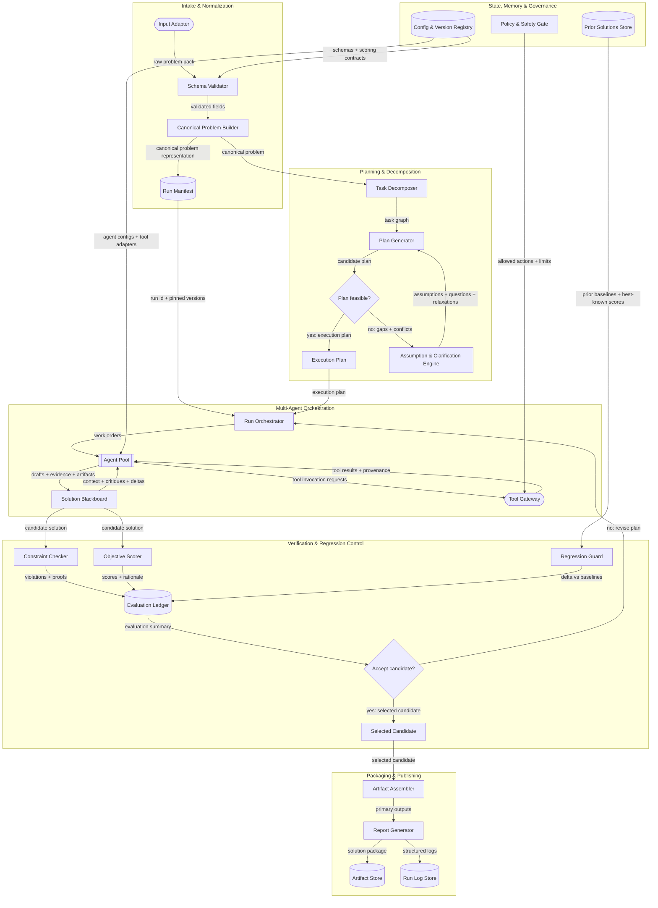

# Design Solution Architecture: Generalized Multi-Agent Problem-Solving System

### **Depth:** conceptual | functional

This document specifies a generalized, production-grade multi-agent problem-solving system architecture that satisfies the provided design brief.

## Architecture in Mermaid Syntax

The system is built as a **reproducible, versioned pipeline** that turns an input “problem pack” into one or more solution artifacts, while continuously verifying constraints, scoring objectives, and preventing regressions against prior runs. It uses multiple agents to generate and critique candidate solutions, but never trusts generation alone—every candidate is gated through explicit checks and a regression guard before it can be published.

To improve operational clarity without changing the underlying architecture, the pipeline is also expressed as a **six-phase contract** (Intake → Planning → Execution → Critique → Synthesis → Output Assembly). Each phase has explicit entry/exit artifacts, gating criteria, and failure-handling semantics, and Phases 4–5 form an internal **Critique ↔ Synthesis** refinement loop with termination rules (quality threshold, iteration cap, budget cap, or improvement plateau).

Legend and diagram conventions are documented at the end of this document.

### What each major subsystem does

- **Intake & Normalization** converts user inputs into a validated, canonical representation and pins all versions (models, prompts, tools, scoring) for reproducibility.
- **Planning & Decomposition** produces an explicit execution plan (a task graph) and makes assumptions/uncertainty visible when feasibility is unclear.
- **Multi-Agent Orchestration** runs a configurable “agent pool” (generation, critique, synthesis, domain experts) against a shared blackboard, using tools through a controlled gateway.
- **Verification & Regression Control** evaluates each candidate against constraints, objectives, and prior baselines; it blocks regressions unless explicitly justified and approved by policy.
- **Packaging & Publishing** assembles the required artifacts and emits a complete solution package including confidence, tradeoffs, compressed reasoning trace, delta vs prior runs, and error logs.
- **State, Memory & Governance** stores prior solutions and run logs, versions all configs, and enforces policy boundaries (e.g., tool allow-lists, data handling rules).

### Phase contracts (operational view)

This phase contract overlays the same components above to make the run state machine explicit and easy to operationalize.

| Phase                  | Entry artifacts                        | Exit artifacts                                               | Gating criteria (examples)                                   | Failure handling (taxonomy)                                  |
| ---------------------- | -------------------------------------- | ------------------------------------------------------------ | ------------------------------------------------------------ | ------------------------------------------------------------ |
| **1) Intake**          | Raw Problem Pack                       | Validated `ProblemPack`, `CanonicalProblem`, `RunManifest` (draft) | Required fields present; no fatal schema errors              | **Fatal** → `needs_info` package; **Blocking** → clarification; **Degrading** → proceed with assumptions |
| **2) Planning**        | `CanonicalProblem`, `test_plan`        | `ExecutionPlan` + strategy selection                         | At least one feasible plan; policy/tool compatibility; within budget | **Blocking** → `needs_info`; **Degrading** → narrowed scope/plan with penalties |
| **3) Execution**       | `ExecutionPlan`                        | Candidate branches + evidence                                | Required draft artifacts exist; provenance hooks present; checkpoint validations pass | **Degrading** → fallback agents/tools; **Blocking** → pause or `needs_info` |
| **4) Critique**        | Candidate branches                     | Constraint report, objective scorecard, critic findings, regression deltas | Hard constraints pass (or loop); no critical critic findings left unresolved | Hard constraint/critical finding → loop to Phase 5           |
| **5) Synthesis**       | Critique outputs + candidate           | Revised candidate branch + modification log                  | Improvement verified; no new regressions; plateau/iteration checks | Plateau/iteration cap → stop and package as `draft` or `needs_info` |
| **6) Output Assembly** | Selected candidate + evaluation ledger | Solution Package (primary outputs + meta artifacts)          | Required outputs present; schemas pass; no fatal errors      | **Blocking** → attempt regeneration/repair; else package partial with explicit status |

Additional gating notes:
- Tier C assumptions (those that affect hard constraints/acceptance checks/policy) force `needs_info` unless explicitly authorized in interactive mode.
- Regressions require an explicit `RegressionExceptionRequest` and a policy approve/deny decision before a candidate can be marked `releasable`.

### Run status (formal)

To promote “needs-info” into a first-class output mode, every run ends in exactly one status:

- `releasable`: passes all hard constraints and required acceptance checks; regressions (if any) are justified and policy-approved.
- `draft`: passes hard constraints but has unverified checks, degraded quality, or unresolved soft constraints; still packaged with warnings.
- `needs_info`: cannot safely proceed to an optimal/releasable solution due to missing measurability, missing acceptance checks, missing validators, or blocking ambiguity; outputs a structured “what’s missing + proposed tightened spec + safest partial plan.”
- `infeasible`: constraints are contradictory or unsatisfiable even after permitted relaxations; outputs contradiction proof and minimal remediation options.

**Status guardrails (to keep outputs certifiable):**
- **Tier C assumptions** (those that affect hard constraints, policy/safety boundaries, or acceptance checks) block `releasable` by default; in batch mode they route to `needs_info` unless policy explicitly permits a bounded draft.
- If scoring/rubric changes make prior baselines **incomparable**, the regression delta is marked `incomparable` and `releasable` is blocked until baselines can be re-scored under the current scoring contract (or a stable regression suite is used).

### Immutable vs mutable elements

**Immutable (invariant across problems and runs)**
These are “system contracts” that must remain stable to prevent regressions and preserve auditability:

Changing these breaks auditability and regression guarantees.

- Canonical schemas for inputs, candidates, evaluations, and outputs (including required output fields)
- The evaluation contract (what must be checked, minimum evidence requirements, scoring normalization)
- Provenance rules (every claim must reference either inputs, tool outputs, or explicitly labeled assumptions)
- Run manifest requirements (pinning versions; deterministic configuration snapshots)
- Logging/audit formats and retention requirements
- Policy & safety gate contract (what categories of actions/tools are permitted)
- Phase contract semantics (entry/exit artifacts, gating criteria requirements, and failure taxonomy)

**Mutable (configurable or evolving)**
These can change over time to improve performance, adapt to domains, or optimize costs:

These are safe to evolve as long as contracts are preserved.

- Agent set composition (roles, prompts, models, routing, budgets)
- Planning heuristics (task decomposition strategies, exploration depth)
- Tool adapters and tool selection strategies
- Objective weighting, tie-break rules, and scoring functions (as long as the evaluation contract remains satisfied)
- Retrieval strategies from prior solutions (how aggressively to reuse, how to cite)
- Post-processing, formatting, and artifact generation strategies
- Termination thresholds (iteration caps, plateau detectors, quality thresholds) when not fixed by policy

Note: Component numbering is structural and does not correspond one-to-one with the six operational phases described above.

## Components & Interfaces

Below, “interface” means a stable contract that any model/tool/agent implementation must satisfy. Acronyms are defined on first use.

### 1) Input Adapter (external interface)

- **Purpose:** Accept problem definitions from any client and map them into the internal input schema.
- **Inputs:** Raw request via API [Application Programming Interface], file uploads, or interactive form fields.
- **Outputs:** `ProblemPack` (structured).
- **Core behavior:**
  - Normalizes fields into a single container:
    - `problem_statement`
    - `success_criteria`
    - `objectives[]` (each with priority + measurement hints; may be grouped as `primary_objective` + ordered `secondary_objectives[]`)
    - `anti_objectives[]` (explicit “avoid” outcomes; each includes `detection_method`)
    - `constraints[]` (hard/soft, scope, enforcement; soft constraints may include `degradation_curve`)
    - `principles[]` (tie-break values)
    - `output_spec` (required artifacts + format + acceptance checks where available)
    - `human_suggestions[]` (mandatory/optional)
    - `context` (environmental facts)
    - `prior_solutions_refs[]` (optional pointers)
  - Adds metadata: request id, user-provided deadlines, confidentiality tags.
- **Error handling & failure modes:**
  - Missing required fields → returns a structured intake error with exact missing keys.
  - Ambiguous outputs → passes ambiguity into the Assumption & Clarification Engine rather than guessing silently.

### 2) Schema Validator

- **Purpose:** Enforce structural integrity and minimum completeness; prevent downstream instability.
- **Inputs:** `ProblemPack`.
- **Outputs:** Validated `ProblemPack` + `ValidationReport`.
- **Core behavior:**
  - Type checks; required fields; constraint formatting; objective measurability hints.
  - Rejects malformed inputs early; flags under-specified areas as “requires assumptions.”
- **Error handling & failure modes:**
  - Hard schema failure → stop “solve” path; emit `needs_info` package inputs (fatal).
  - Soft completeness failure → continue with explicit “assumptions required” flags (degrading).

### 3) Canonical Problem Builder

- **Purpose:** Create a stable internal representation that is comparable across runs and domains.
- **Inputs:** Validated `ProblemPack`.
- **Outputs:** `CanonicalProblem` + initial `AssumptionSet`.
- **Core behavior:**
  - Normalizes synonyms (e.g., “must” vs “required”), deduplicates constraints, and creates:
    - `ObjectiveModel` (targets, metrics, weights, acceptance thresholds; supports a primary/secondary hierarchy)
    - `AntiObjectiveModel` (avoidances + detectors; treated as high-weight soft constraints unless declared hard)
    - `ConstraintModel` (hard/soft, test methods; soft constraints include `weight` + optional `degradation_curve` such as linear/exponential/step)
    - `ArtifactContract` (what must be produced, allowed formats, acceptance checks)
    - `RiskModel` (known unknowns)
  - Produces a “measurement plan” describing how objectives/constraints will be evaluated.
- **Error handling & failure modes:**
  - Conflicting hard constraints → marks plan infeasible and triggers Assumption & Clarification Engine.

### 3a) Test Plan Builder

*Auxiliary component extending Section 3; does not introduce a new pipeline phase.*

- **Purpose:** Make verification explicit, versioned, and comparable across runs by generating a first-class test plan artifact.
- **Inputs:** `CanonicalProblem`, `ArtifactContract`, `ConstraintModel`, `ObjectiveModel`.
- **Outputs:** `test_plan.yaml` (YAML [YAML Ain’t Markup Language]) + `coverage_targets` + `validator_registry` references.
- **Core behavior:**
  - Enumerates acceptance checks per required artifact (from `output_spec` and contract defaults).
  - Specifies constraint validators, execution order (fail-fast on hard constraints), and cross-artifact consistency checks.
  - Declares verification coverage targets (e.g., “100% hard constraints have deterministic validators”).
- **Error handling & failure modes:**
  - Missing acceptance checks for required artifacts → triggers `needs_info` status unless policy allows “draft mode.”
  - Missing validator for a hard constraint → blocks `releasable`; forces `draft`/`needs_info` with explicit remediation.

### 4) Run Manifest (persistent record)

- **Purpose:** Make every run reproducible and auditable.
- **Inputs:** Canonical problem, configuration snapshot.
- **Outputs:** `RunManifest` stored in a database record.
- **Core behavior:**
  - Pins: model versions, prompt templates, tool versions, scoring versions, random seeds, budgets.
  - Records: timestamps, environment hashes, policy configuration.
  - Includes test-plan identity (hash/reference) so “what was tested” is reproducible.
- **Error handling & failure modes:**
  - Cannot pin versions (e.g., unversioned tool) → degrade by snapshotting tool responses for this run.

### 5) Task Decomposer

- **Purpose:** Turn the canonical problem into a task graph that can be distributed across agents.
- **Inputs:** `CanonicalProblem` (and `test_plan.yaml` to ensure tasks include verification hooks).
- **Outputs:** `TaskGraph` (nodes, dependencies, acceptance checks).
- **Core behavior:**
  - Produces tasks such as: requirements extraction, solution sketching, risk analysis, artifact drafting, evaluation design.
  - Annotates tasks with required tools and verification steps.
- **Error handling & failure modes:**
  - Over-decomposition (too many tasks) → caps graph size by budget; merges low-value nodes.

### 6) Plan Generator

- **Purpose:** Choose an execution plan (ordering + agent/tool assignments) that best meets objectives under constraints.
- **Inputs:** `TaskGraph`, budget constraints, prior solution baselines.
- **Outputs:** `ExecutionPlan`.
- **Core behavior:**
  - Chooses a strategy: fast path (simple tasks) vs deep path (complex artifacts).
  - Assigns tasks to agent roles; sets iteration counts for generate/critique loops (explicit Critique ↔ Synthesis loop controls).
- **Error handling & failure modes:**
  - Plan conflicts with policy (disallowed tools) → replan with allowed tools only.

### 7) Assumption & Clarification Engine

- **Purpose:** Make uncertainty explicit; resolve infeasibility without silent failure.
- **Inputs:** Feasibility issues, ambiguous requirements, conflicts.
- **Outputs:** `AssumptionSet`, `ClarifyingQuestions[]`, `RelaxationProposal[]`.
- **Core behavior:**
  - Generates ranked assumptions that would make the plan feasible.
  - Classifies assumptions by impact tier so downstream gates can reason about safety and certifiability:
    - **Tier A (cosmetic/formatting):** does not affect hard constraints or acceptance checks.
    - **Tier B (quality-impacting):** affects objective attainment but not hard constraints; allowed in `draft` with explicit penalties/warnings.
    - **Tier C (certification-impacting):** affects hard constraints, policy/safety boundaries, or acceptance checks; default behavior is to block `releasable` and route to `needs_info` unless explicitly authorized in interactive mode.
  - If interactive mode is available: asks questions (especially to resolve Tier C unknowns).
  - If non-interactive mode: proceeds only with best-supported Tier A/B assumptions (labeled); Tier C unknowns become `needs_info` unless policy explicitly permits a bounded “assume-and-flag” draft.
- **Error handling & failure modes:**
  - If no assumption makes feasibility possible → produces a “best-effort partial plan” and marks constraints unmet; run status becomes `needs_info` or `infeasible` (depending on contradiction proof).

### 8) Run Orchestrator

- **Purpose:** Coordinate the end-to-end run; enforce budgets and iteration rules.
- **Inputs:** `ExecutionPlan`, `RunManifest`.
- **Outputs:** Candidate solutions, final selected solution, run status.
- **Core behavior:**
  - Schedules agent work; manages retries; stops when acceptance criteria are met or budget is exhausted.
  - Enforces invariants: all candidates must include provenance, assumption lists, and evaluation hooks.
  - Maintains run status (`releasable | draft | needs_info | infeasible`) and ensures packaging always occurs (even if not releasable).
- **Error handling & failure modes:**
  - Agent failures/timeouts → retry with fallback agent/model; record incident in error log.

### 8a) Phase Controller (Conductor)

*Auxiliary component extending Section 8; does not introduce a new pipeline phase.*

- **Purpose:** Make phase transitions and termination conditions explicit and auditable, improving operability without changing core components.
- **Inputs:** Phase completion signals, gating criteria results, resource usage metrics.
- **Outputs:** Phase activation commands, termination decision (with reason), run status updates.
- **Core behavior:**
  - Activates phases sequentially and enforces gating checks before transitions.
  - Manages the Critique ↔ Synthesis loop using explicit termination rules (quality threshold met, iteration limit reached, budget exhausted, or improvement plateau detected).
- **Error handling & failure modes:**
  - Fatal failures → terminate and force packaging in `needs_info`/`infeasible` mode.
  - Blocking failures → request clarification if allowed; else `needs_info`.

### 8b) Router

*Auxiliary component extending Section 8; does not introduce a new pipeline phase.*

- **Purpose:** Dispatch work to appropriate specialized agents based on capability fit, load, and historical performance.
- **Inputs:** Task requests, agent registry/capabilities, blackboard state.
- **Outputs:** Task assignments, fallback assignments on failure.
- **Core behavior:**
  - Selects agent(s) per task and manages redundancy when risk is high (e.g., generate-two-then-critique).
- **Error handling & failure modes:**
  - No capable agent → blocking failure; escalate to Phase Controller for replanning or `needs_info`.

### 9) Agent Pool (standard agent interface)

- **Purpose:** Produce candidate reasoning and artifacts using specialized roles.
- **Inputs:** Work order (task + context), blackboard state, allowed tools list.
- **Outputs:** `CandidateContribution` (draft, evidence, suggested checks, uncertainty).
- **Core behavior:**
  - Roles are configurable; typical minimal set:
    - **Generator agent**: proposes solutions/artifacts.
    - **Critic agent**: finds flaws, missing constraints, weak evidence.
    - **Verifier agent**: designs/tests checks; validates claims.
    - **Synthesizer agent**: merges best parts, resolves conflicts.
  - Model-agnostic: agents may be LLMs [Large Language Models], deterministic programs, or hybrid.
  - Structural independence requirement for evaluation: critic/verifier agents must be configured to be meaningfully independent from generator agents (different prompt templates and, when feasible, different model version/family); an adversarial critique round is mandatory for high-risk or hard-constraint-heavy problems.
- **Error handling & failure modes:**
  - Hallucinated claims (unsupported assertions) → critic/verifier flags; candidate fails provenance checks.
  - Mode collapse (agents agree too easily) → enforce adversarial critique round with different configuration.

### 10) Solution Blackboard (shared state)

- **Purpose:** Provide a single source of truth for evolving candidate solutions and evidence.
- **Inputs:** Contributions from agents; tool results.
- **Outputs:** Current candidate set + structured evidence graph.
- **Core behavior:**
  - Maintains:
    - `Claims[]` each linked to evidence or assumptions
    - `Artifacts[]` with versions/diffs
    - `OpenIssues[]` and `ResolvedIssues[]`
  - Supports branching: multiple candidates evaluated in parallel.
- **Error handling & failure modes:**
  - Inconsistent state updates → resolves via versioned writes and merge rules.

### 10a) Arbiter

*Auxiliary component extending Section 10; does not introduce a new pipeline phase.*

- **Purpose:** Resolve conflicts when agents produce contradictory outputs (e.g., incompatible assumptions, conflicting constraint interpretations, or divergent artifact versions).
- **Inputs:** Conflict reports from the blackboard, candidate diffs, applicable objectives/constraints/principles.
- **Outputs:** Resolution decision (selected output), rationale, and confidence annotation.
- **Core behavior:**
  - Requests justification from the disagreeing agents when needed.
  - Chooses the resolution that best satisfies hard constraints first, then optimizes objective hierarchy and principles as tie-breakers.
  - Produces an audit entry so future regressions can be tested.
- **Error handling & failure modes:**
  - Unresolvable equivalence → degrade to `draft` and surface in `needs_info` section (or request human input if interactive).

### 11) Tool Gateway (external systems interface)

- **Purpose:** Provide tool access in a controlled, auditable, policy-compliant manner.
- **Inputs:** Tool invocation requests from agents.
- **Outputs:** Tool results + provenance metadata (source, timestamp, parameters).
- **Core behavior:**
  - Standardizes tool contracts (inputs, outputs, errors).
  - Routes each invocation through the Policy & Safety Gate for an allow/deny decision before execution; denials return rationale and are logged.
  - Caches results when allowed to improve repeatability.
  - Records tool provenance into the blackboard and logs.
- **Error handling & failure modes:**
  - Tool outage → fallback tool or degrade gracefully; record partial results.
  - Non-deterministic tools → snapshot outputs for audit.

### 12) Policy & Safety Gate

- **Purpose:** Enforce hard boundaries on actions and data handling.
- **Inputs:** Tool invocation attempt, data classification tags, run policy config.
- **Outputs:** Allow/deny decision + rationale.
- **Core behavior:**
  - Applies allow-lists/deny-lists.
  - Enforces confidentiality rules and redaction requirements.
  - Evaluates **every** tool invocation at call time (tool name, parameters, purpose, and data-classification tags); the tool gateway executes only after an allow decision.
  - Records a `PolicyDecision` (allow/deny + rationale + relevant policy version) into the run log so denials and approvals are explainable and reproducible.
  - Also governs non-tool governance decisions that affect publishability (e.g., regression-exception approvals) using the same audit contract.
- **Error handling & failure modes:**
  - Policy misconfiguration → fail closed (deny) for high-risk operations; emit policy error.

### 13) Constraint Checker

- **Purpose:** Determine whether hard/soft constraints are satisfied.
- **Inputs:** Candidate solution + `ConstraintModel`.
- **Outputs:** `ConstraintReport` (pass/fail, violations, severity, evidence).
- **Core behavior:**
  - Executes constraint tests (format checks, logical constraints, resource constraints).
  - For soft constraints: produces penalty values rather than binary fail, using configured `degradation_curve` where provided.
  - Treats anti-objective detections as constraint-like signals when modeled as avoidances.
- **Error handling & failure modes:**
  - Untestable constraint (no available checker) → marks “unverified”; reduces confidence score; blocks `releasable` if the constraint is hard.

### 14) Objective Scorer

- **Purpose:** Quantify how well a candidate achieves objectives.
- **Inputs:** Candidate solution + `ObjectiveModel`.
- **Outputs:** `ObjectiveScoreCard` (per-objective scores, aggregate score, justification).
- **Core behavior:**
  - Uses a mix of deterministic metrics (when available) and rubric-based evaluation (when not).
  - Stores scoring rationale in compressed form.
  - Tags every scorecard with the scoring-contract identity (rubric/weights/version) so cross-run comparisons can be validated for comparability.
  - Supports objective hierarchy: primary objective satisfaction gates the optimization of secondary objectives when required by policy.
- **Error handling & failure modes:**
  - Rubric drift (inconsistent scoring across runs) → mitigate via pinned rubrics and calibration checks.

### 15) Regression Guard

- **Purpose:** Prevent regressions relative to prior solutions and best-known baselines.
- **Inputs:** Candidate evaluation results + `PriorSolutions` baselines.
- **Outputs:** `RegressionDelta` (improvements, regressions, justification requirements).
- **Core behavior:**
  - Enforces **score comparability** before treating deltas as regressions/improvements:
    - If the scoring contract/weights/rubrics changed, it either **re-scores baselines under the current scoring contract** (when historical artifacts are available) or falls back to an explicitly versioned **stable regression suite** whose metrics are immutable.
    - If neither is possible, the delta is marked `incomparable`, `releasable` is blocked, and the run is packaged as `draft`/`needs_info` with an explicit remediation step (e.g., “store historical artifacts for re-score”).
  - Compares candidates to:
    - Best known aggregate score
    - Constraint satisfaction history
    - Artifact completeness and quality checks
  - Blocks publishing if a regression is detected unless:
    - A `RegressionExceptionRequest` is created (justification + impact + affected objectives/constraints) and routed to the Policy & Safety Gate for an explicit approve/deny decision, which is stored in the Evaluation Ledger.
    - The regression is explicitly justified (e.g., new constraint)
    - Policy allows it
- **Error handling & failure modes:**
  - Missing baseline → falls back to absolute acceptance thresholds and flags “no baseline” in report.

### 16) Evaluation Ledger (persistent)

- **Purpose:** Provide a single, queryable record of evaluation outcomes.
- **Inputs:** Constraint reports, objective scorecards, regression deltas, critic severity rankings, verification coverage.
- **Also stores:** `PolicyDecision` records relevant to publishability (e.g., regression-exception approvals/denials) and the scoring-contract identity used for each evaluation record.
- **Outputs:** Stored `EvaluationRecord` linked to run id and candidate id.
- **Core behavior:**
  - Normalizes scores.
  - Tracks coverage (which checks were executed) and whether any hard constraints were “unverified.”
  - Stores top-k candidate summaries so the packager can emit a Pareto [multi-objective optimization concept] frontier of alternatives.
- **Error handling & failure modes:**
  - Partial evaluation → still store; confidence score incorporates missing coverage penalty.

### 17) Artifact Assembler

- **Purpose:** Construct the final artifacts required by the output specification.
- **Inputs:** Selected candidate + `ArtifactContract`.
- **Outputs:** Primary outputs (documents, code, plans, etc.).
- **Core behavior:**
  - Validates artifact format and completeness.
  - Ensures traceability: which parts came from which evidence/assumptions.
- **Error handling & failure modes:**
  - Artifact formatting errors → automatic repair pass; if fails, emit partial artifacts + error log.

### 18) Report Generator (solution package builder)

- **Purpose:** Produce the required meta-outputs alongside primary artifacts.
- **Inputs:** Selected candidate, evaluation records, run logs, prior solution baseline, top-k candidate set.
- **Outputs:** `SolutionPackage` including:
  - **Primary outputs** (per output spec)
  - **Solution confidence score**
  - **Tradeoff analysis**
  - **Compressed reasoning trace** (no raw chain-of-thought)
  - **Comparison to prior solutions** (delta + justification)
  - **Governance decisions** (e.g., tool denials, regression-exception approvals/denials)
  - **Assumption tier summary** (Tier A/B/C counts + where Tier C blocked certification)
  - **Scoring-contract + comparability note** (e.g., “baselines re-scored under vX” or “stable regression suite vY”)
  - **Error log** (structured)
  - **Pareto frontier alternatives** (top-k constraint-valid candidates optimized for different objective tradeoffs, when available)
  - **Test plan + coverage summary** as supporting artifacts
- **Core behavior:**
  - Confidence score model (example approach):
    - Start with objective achievement score
    - Multiply by verification coverage factor
    - Hard constraints must pass (otherwise cap confidence)
    - Penalize unverified constraints and high uncertainty
  - Emits explicit run status (`releasable | draft | needs_info | infeasible`) and explains why.
- **Error handling & failure modes:**
  - Missing evaluation artifacts → mark confidence as low and explain which checks were skipped.

### 18a) Needs-Info Packager

*Auxiliary component extending Section 18; does not introduce a new pipeline phase.*

- **Purpose:** Guarantee a useful, structured output even when the system cannot safely proceed to an optimal/releasable solution.
- **Inputs:** Validation errors, missing acceptance checks/validators, blocking ambiguities, infeasibility proofs, partial drafts (if any).
- **Outputs:** A `SolutionPackage` marked `needs_info` **or** `infeasible` (when a contradiction proof exists) containing:
  - missing/ambiguous fields list
  - proposed tightened `output_spec` and measurement/verification additions
  - safest partial plan that can be executed now
  - capped confidence + explicit risk notes
- **Core behavior:**
  - Converts “cannot proceed” into an actionable remediation plan that preserves auditability and repeatability.
- **Error handling & failure modes:**
  - If inputs are too malformed to parse, still emits a minimal structured error bundle with exact parse failures.

### 19) Artifact Store / Prior Solutions Store / Run Log Store / Config & Version Registry

- **Purpose:** Persistence for artifacts, baselines, audit logs, and configuration history.
- **Inputs/Outputs:**
  - Artifact Store: final and intermediate artifacts
  - Prior Solutions Store: the “best known” solution packages and their evaluations
  - Run Log Store: structured event logs, errors, tool provenance
  - Config & Version Registry: versioned definitions of schemas, prompts, rubrics, policies
- **Error handling & failure modes:**
  - Storage write failure → return artifacts inline (if possible) + mark run as “not fully persisted.”

## Rationale

In this section:
- Why this design is optimal for generalized problem solving
- Why the chosen inputs are optimal
- Why the chosen outputs are optimal
- Alternative designs considered and why they were rejected
- Key architectural tradeoffs

### Why this design is optimal for generalized problem solving

- **Separation of concerns enables reliability:** generation (agents) is separated from verification (checkers/scorers) and from governance (policy gate). This makes it harder for a single failure mode to silently corrupt outputs.
- **Auditability is first-class:** pinned versions, run manifests, provenance, and structured logs make it possible to reproduce and debug outcomes.
- **Regression resistance is engineered, not hoped for:** the regression guard turns “continuous improvement” into a measurable contract—new outputs must beat or match baselines or clearly explain why not.
- **Domain generality comes from contracts:** by standardizing the problem representation, tool interface, evaluation ledger, and output package, the system can swap in domain-specific agents/tools without changing the pipeline.
- **Operational clarity is explicit:** the phase contract view makes gating, iteration loops, and termination conditions auditable while preserving the underlying modular architecture.
- **Decision quality improves with alternatives:** top-k candidate retention and Pareto frontier packaging ensure stakeholders can choose among multiple constraint-valid options when objectives trade off.

### Why the chosen inputs are optimal

The input design is intentionally compact but expressive:

- A **canonical problem pack** captures what must be done (objectives), what must not be violated (constraints), and how to choose between acceptable options (principles).
- **Human suggestions** are explicitly typed (mandatory vs optional), preventing ambiguous “advice” from being accidentally treated as a requirement.
- **Prior solution references** are a first-class input, enabling regression prevention and reuse.
- **Anti-objectives** and soft-constraint degradation curves make “what to avoid” and “how to trade off” computable rather than implicit.

This combination maximizes clarity while staying tool- and model-agnostic.

### Why the chosen outputs are optimal

The output package is designed for both “do the work” and “prove the work”:

- Primary artifacts satisfy the direct requirement.
- Confidence, tradeoffs, and a compressed reasoning trace communicate uncertainty and rationale without exposing raw internal deliberation.
- Comparison to prior solutions is required for continuous improvement.
- A structured error log enables debugging and evaluation at scale.
- A first-class `needs_info` mode guarantees a useful, auditable artifact even when optimality cannot be safely claimed.
- A Pareto frontier summary improves decision support when multiple constraint-valid solutions exist.

### Alternative designs considered and why they were rejected

1. **Single-agent monolith**
   Rejected because it is brittle: failures are harder to detect, audit trails are weaker, and regressions are easier to introduce unnoticed.
2. **Unstructured agent swarm**
   Rejected because unconstrained multi-agent interaction tends to be noisy, harder to reproduce, and difficult to evaluate consistently without a shared state model and explicit gates.
3. **Pure retrieval + template filling**
   Rejected because it fails on genuinely novel problems and cannot reliably handle new constraints or unusual outputs.
4. **End-to-end learning-only optimization (e.g., reinforcement learning)**
   Rejected as the primary approach because it is harder to audit and can regress silently; it can be layered in later to optimize subcomponents, but the baseline must remain contract-driven.

### Key architectural tradeoffs

- **More components vs simpler implementation:** This architecture introduces overhead (schemas, ledgers, multiple passes). The tradeoff is improved reliability, auditability, and regression control.
- **Rubric-based scoring vs deterministic scoring:** Many domains lack objective metrics. Rubrics add subjectivity, so the system mitigates this via pinned rubrics, calibration checks, and coverage reporting.
- **Repeatability vs freshness:** Tool calls can introduce non-determinism. The system prioritizes repeatability by pinning versions and snapshotting tool outputs when necessary, while still allowing live tool usage under policy.
- **Single “best” output vs multiple valid outputs:** Retaining top-k candidates adds some compute/storage overhead, but enables Pareto frontier packaging and reduces the risk of over-optimizing for a misweighted objective.

## Mermaid Conventions

- **Diagram orientation:** Use top-to-bottom (`flowchart TB`) when the pipeline is deep and staged.
- **Grouping:** Use `subgraph` to group subsystems; keep nesting shallow to preserve readability.
- **Node semantics:**
  - Rectangles represent processing components.
  - Database shapes represent persisted state.
  - Rounded nodes represent external systems or gateways.
  - Diamonds represent decisions/gates.
  - Double-bracket nodes represent reusable modules (e.g., the agent pool contract).
- **Edges:** Prefer synchronous arrows for stepwise flow; label edges with the payload or signal being transferred.
- **Evolution:** When iterating the architecture, use visual styling to mark unchanged vs modified components, but keep the structural contracts stable.

## Interaction Model

In this section:
- Assumptions
- End-to-end run lifecycle (single pass, iterative internally)
- What “compressed reasoning trace” contains (by contract)
- Failure taxonomy (system-wide)
- What goes into the error log (structured)

### Assumptions

- The system may run in **interactive** mode (it can ask clarifying questions) or **batch** mode (it must proceed with explicit assumptions).
- Policy & safety decisions are enforced inline at the moment of each tool invocation (and logged), not merely precomputed as an allow-list.
- Tools may be unavailable or non-deterministic; the system must remain safe and auditable by degrading gracefully and logging gaps.
- “Optimal” means: maximize objective attainment subject to hard constraints, using principles as tie-breakers, and non-regression against prior accepted baselines unless justified.
- The system must always produce a structured output package with an explicit run status (`releasable | draft | needs_info | infeasible`), even when it cannot safely claim optimality.

### End-to-end run lifecycle (single pass, iterative internally)

1. **Intake (Phase 1)**
   - Receive a problem pack; validate schema; build canonical problem representation.
   - Build `test_plan.yaml` and coverage targets.
   - Create a run manifest that pins versions and budgets.
   - If fatal schema issues: produce `needs_info` package.
2. **Plan (Phase 2)**
   - Decompose into a task graph.
   - Generate an execution plan with explicit verification steps and loop controls.
   - If infeasible or ambiguous: produce assumptions and, if possible, clarifying questions.
   - If blocking gaps remain: produce `needs_info` package.
3. **Execute (Phase 3)**
   - Phase Controller activates execution; Router dispatches tasks to the agent pool.
   - Agents write drafts, propose artifacts, cite evidence, and register uncertainties on the solution blackboard.
   - Tool gateway fetches external results with provenance and policy enforcement.
4. **Critique (Phase 4)**
   - Each candidate is checked against constraints and scored against objectives.
   - Regression guard compares to prior baselines.
   - Adversarial critique synthesizes issues and severity to drive repairs.
5. **Synthesize (Phase 5, internal loop with Phase 4)**
   - If the candidate fails: orchestrator loops back with targeted revisions (not a full restart), focusing on failed checks.
   - Terminate the loop when:
     - acceptance criteria are met,
     - iteration limit reached,
     - resource budget exhausted,
     - or improvement plateau detected.
   - If plateau reached with unresolved blocking gaps: finalize as `draft` or `needs_info` (depending on whether missing information prevents safe optimization).
6. **Select**
   - The acceptance gate chooses the best candidate that:
     - Passes hard constraints,
     - Meets minimum objective thresholds,
     - Does not regress against baselines **under a comparable scoring contract** (or triggers baseline re-score / stable regression suite),
     - If a regression is necessary, creates a `RegressionExceptionRequest` and receives an explicit approve/deny `PolicyDecision` before `releasable` publication.
   - Preserve top-k candidates for Pareto frontier packaging.
7. **Package (Phase 6)**
   - Assemble required artifacts.
   - Generate the solution package containing:
     - Confidence score (including verification coverage)
     - Tradeoff analysis (including Pareto frontier alternatives when available)
     - Compressed reasoning trace (key decisions, not raw deliberation)
     - Delta vs prior solutions
     - Structured error log with failure taxonomy categories
     - Test plan + coverage summary
8. **Persist + Feed back**
   - Store artifacts, evaluation records, and run logs.
   - Promote the accepted solution to the prior solutions store as a new baseline.
   - The entire solution package becomes valid input for the next run, enabling iterative improvement with regression protection.

### What “compressed reasoning trace” contains (by contract)

- The final set of assumptions and why they were necessary.
- The top decision points (e.g., “chose approach A over B because it satisfied constraint X and improved objective Y”).
- The key verification outcomes that gated acceptance.
- Explicit unresolved issues (if any) and their impact.

### Failure taxonomy (system-wide)

All components classify failures consistently:

- **Fatal:** cannot proceed; must terminate “solve path” and package `needs_info`/`infeasible`.
- **Blocking:** can proceed only with clarification or explicit user-approved relaxations; otherwise `needs_info`.
- **Degrading:** proceed with reduced confidence/score; must be disclosed in tradeoffs and confidence factors.
- **Informational:** log-only; no meaningful impact on correctness/completeness.

### What goes into the error log (structured)

- Component name, timestamp, severity (fatal/blocking/degrading/informational)
- Failure mode category (schema, tool, evaluation, policy, synthesis)
- What was attempted, what failed, and what fallback was used
- Whether the failure affects correctness, completeness, or confidence

This interaction model ensures the system can solve a wide range of tasks while staying repeatable, auditable, and continuously improvable without silent regressions.