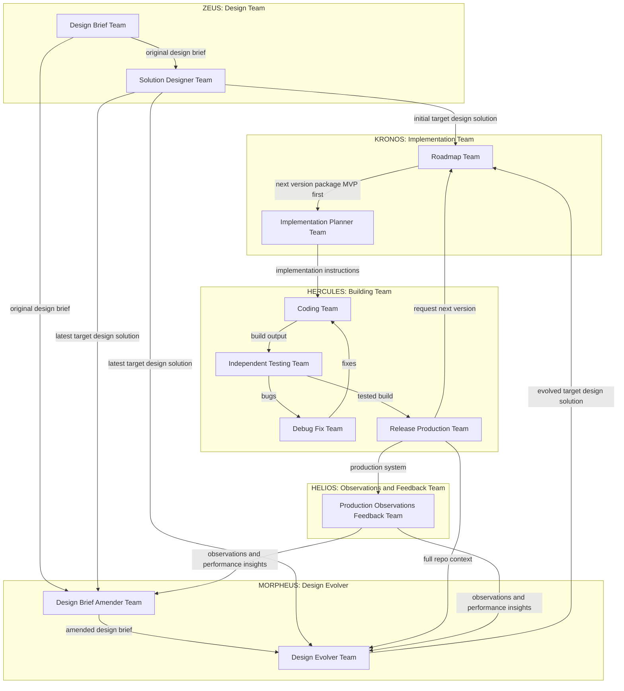

# Global System Architecture (Team View)

This diagram describes a simple, team-oriented workflow for taking an original design brief from concept through implementation, testing, production release, observation, and continuous improvement. It supports learning-driven refinement by including both Design Brief Amender and Design Evolver functions inside a single Design Evolver block, so real-world observations can refine the brief and evolve the target design over time.

## Design Team

**Design Team (block):** This block establishes the initial intent and shape of the system. It produces the original brief and an initial target design solution that describes what “good” looks like before learnings from real-world production start to reshape the path.

**Design Brief Team:** This team owns the problem framing and writes the **Original Design Brief**, including objectives, constraints, success definition, and output expectations. This brief is treated as the initial hypothesis that can later be amended based on evidence from production.

**Solution Designer Team:** This team turns the original brief into the **Target Design Solution**—the best theoretical design for solving the problem.

## Implementation Planning Team

**Implementation Planning Team (block):** This block translates design intent into buildable, sequenced work. It ensures the organization is always working on the next most sensible increment rather than trying to jump straight to the full target design.

**Roadmap Team:** This team decomposes the target design solution into a sequence of versions. The first version is the MVP [Minimum Viable Product], and subsequent versions progressively move toward the target. The Roadmap Team passes **one version package at a time** downstream to keep execution focused and iterative.

**Implementation Planner Team:** This team converts the current version package into actionable implementation instructions. Their output guides the Building Team and reduces iterations' complexity to reduce build risk.

## Building Team

**Building Team (block):** This block executes the plan: build, test, fix, and release. It is where designs become working software, and it contains the fastest operational feedback loop (bugs found in testing drive fixes back into implementation).

**Coding Team:** Implements the version package per the implementation instructions, producing the build that is handed to independent testing. They also integrate fixes that come back through the debug loop.

**Independent Testing Team:** Tests the build independently of the coding function to reduce blind spots and bias. Their output is either a clean, tested build or a set of bugs that must be fixed before release.

**Debug Fix Team:** Receives bugs uncovered by testing and produces fixes that flow back to the coding team. Conceptually, this keeps the “build–test–fix” cycle tight and repeatable.

**Release Production Team:** Releases the tested build into production. After each release, this team triggers the next iteration by requesting the next version package from the Roadmap Team.

## Observations and Feedback Team

**Observations and Feedback Team (block/team):** Observes and evaluates the production system only. It produces **Observations and Performance Insights** that capture how the system behaves in the real world and how well it performs against objectives.

## Design Evolver

**Design Evolver (block):** This block is the “learning-to-design” loop. It consists of two tightly related functions: amending the brief based on evidence, and evolving the target design solution based on the amended brief plus current system reality.

**Design Brief Amender Team:** Takes the Original Design Brief, the latest target design solution, and Observations and Performance Insights, then produces an **Amended Design Brief**. The goal is to correct problem framing, objectives, constraints, and success criteria as reality reveals gaps or misassumptions.

**Design Evolver Team:** Takes the Amended Design Brief, the latest target design solution, the full repo context (what actually exists), and Observations and Performance Insights, then produces an **Evolved Target Design Solution**. That evolved target flows back to the Roadmap Team, which breaks it into the next sequence of version packages—continuing the loop of improvement.