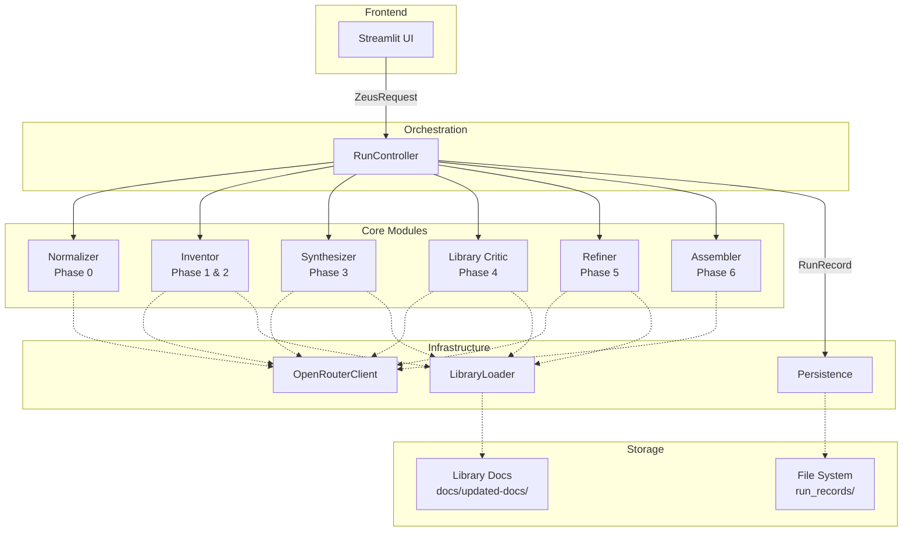
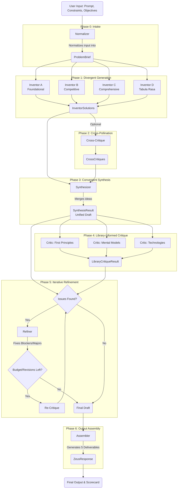
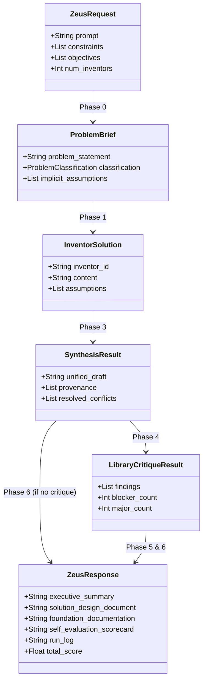

# Zeus Agent - Architecture and Workflow

This document provides a comprehensive analysis of the Zeus Agent project, including system design, workflow, model selection, and data flow.

## 1. System Overview

Zeus Agent (Capital Squared Dashboard) is a multi-agent, 7-phase pipeline designed to solve complex business and technology problems. It takes a problem brief, constraints, and objectives, and uses parallel LLM-powered "inventors" to generate divergent solutions. These solutions are then cross-pollinated, synthesized, critiqued against predefined libraries (First Principles, Mental Models, Technologies, etc.), refined iteratively, and finally assembled into a comprehensive set of deliverables.

The system is built with a Streamlit frontend (`ui.py`) and a robust asynchronous backend (`src/core/run_controller.py`) that orchestrates the pipeline using the OpenRouter API for LLM calls.

---

## 2. System Architecture

The architecture follows a modular, decoupled design where the `RunController` orchestrates various core components.

---

## 3. Pipeline Workflow

The Zeus pipeline consists of 7 distinct phases. The pipeline is designed to be resilient; if a phase fails, the system attempts a best-effort assembly of the outputs generated so far.

---

## 4. Phase Model Selection

Zeus allows granular control over which LLM model is used for each phase. This is configured in the UI and passed to the `RunController` via `model_overrides`.

| Phase | Component | Default Model | Purpose |
| :--- | :--- | :--- | :--- |
| **Phase 0** | Normalizer | `anthropic/claude-sonnet-4` | Structuring and classifying the raw user input. |
| **Phase 1** | Inventor | `anthropic/claude-sonnet-4` | Creative, divergent generation of solutions based on assigned libraries. |
| **Phase 2** | Cross-Pollination | `anthropic/claude-sonnet-4` | Analyzing and critiquing peer solutions. |
| **Phase 3** | Synthesizer | `anthropic/claude-sonnet-4` | Merging multiple solutions, resolving conflicts, and tracking provenance. |
| **Phase 4** | Library Critic | `anthropic/claude-sonnet-4` | Strict evaluation of the draft against specific library principles. |
| **Phase 5** | Refiner | `anthropic/claude-sonnet-4` | Iteratively fixing identified blockers and major issues. |
| **Phase 6** | Assembler | `anthropic/claude-sonnet-4` | Formatting the final deliverables and generating the self-evaluation scorecard. |

*Note: The system uses `OpenRouterClient` which supports fallback and retry mechanisms for rate limits and timeouts.*

---

## 5. Data Flow & Schemas

Data is strictly typed using Pydantic models (`src/models/schemas.py`). The `RunRecord` acts as a central state object that accumulates data as it passes through the pipeline.

---

## 6. Execution Sequence

The following sequence diagram illustrates the asynchronous execution flow from the Streamlit UI to the final output.

```mermaid
sequenceDiagram
    participant User
    participant UI as Streamlit UI
    participant Thread as Background Thread
    participant RC as RunController
    participant LLM as OpenRouterClient
    participant Persist as Persistence

    User->>UI: Click "Run Zeus"
    UI->>Thread: Start _run_pipeline_thread()
    Thread->>RC: run(ZeusRequest)
    
    rect rgb(40, 45, 65)
        Note over RC, LLM: Phase 0: Intake
        RC->>LLM: Normalize Input
        LLM-->>RC: ProblemBrief
    end
    
    rect rgb(40, 45, 65)
        Note over RC, LLM: Phase 1: Divergent Generation
        RC->>LLM: Run Inventors (Parallel)
        LLM-->>RC: InventorSolutions
    end
    
    rect rgb(40, 45, 65)
        Note over RC, LLM: Phase 3: Synthesis
        RC->>LLM: Synthesize Solutions
        LLM-->>RC: SynthesisResult (Unified Draft)
    end
    
    rect rgb(40, 45, 65)
        Note over RC, LLM: Phase 4: Critique
        RC->>LLM: Run Library Critics (Parallel)
        LLM-->>RC: LibraryCritiqueResult
    end
    
    rect rgb(40, 45, 65)
        Note over RC, LLM: Phase 5: Refinement (Loop)
        loop Max Revisions
            RC->>LLM: Refine Draft
            LLM-->>RC: Refined Draft
        end
    end
    
    rect rgb(40, 45, 65)
        Note over RC, LLM: Phase 6: Assembly
        RC->>LLM: Assemble Deliverables & Scorecard
        LLM-->>RC: ZeusResponse
    end
    
    RC->>Persist: save(RunRecord)
    Persist-->>RC: Success
    RC-->>Thread: Return ZeusResponse
    Thread-->>UI: Update Session State
    UI-->>User: Display Results & Scorecard
```

## 7. Budget and Error Handling

- **Budgeting**: The system tracks `llm_calls`, `tokens_in`, and `tokens_out` via the `BudgetUsed` schema. If `max_llm_calls` is exceeded, a `BudgetExceededError` is raised, halting further generation but triggering a best-effort assembly of existing data.
- **Error Isolation**: Each phase is wrapped in a `_safe_phase` executor. If a phase fails (e.g., due to LLM timeouts), the error is logged to `RunRecord.errors`, and the pipeline attempts to continue or gracefully assemble whatever was completed.
- **Retries**: The `OpenRouterClient` implements exponential backoff for rate limits (429) and server errors (5xx), ensuring transient API issues do not crash the pipeline.
