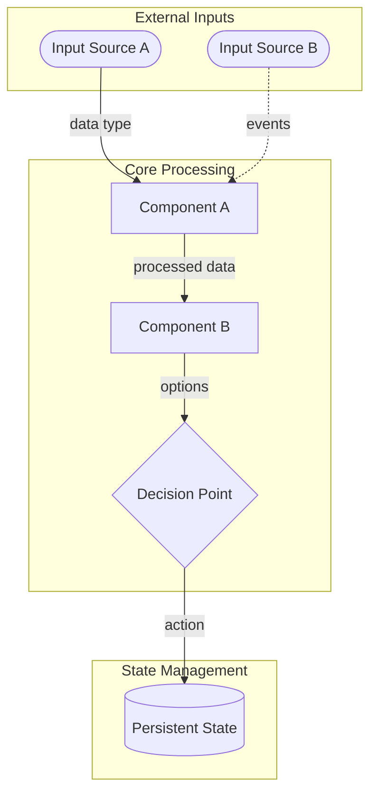

# Output Specification

---

## Overview

This document specifies the required format, structure, and content for deliverables produced in response to the Invention Design Brief. It ensures all solutions are presented in a consistent, evaluable format that maps directly to the Problem Statement, Objectives, Constraints, and Evaluation Criteria.

The deliverables serve two purposes: (1) to communicate the invented solution with sufficient clarity and detail for evaluation, and (2) to provide the foundation documents necessary to begin implementation if the solution is selected.

---

## Deliverable Structure

The complete solution submission consists of **five required deliverables**:

| # | Deliverable | Purpose |
|---|-------------|---------|
| 1 | Executive Summary | One-page overview for rapid assessment |
| 2 | Solution Design Document | Comprehensive solution specification including constraint compliance |
| 3 | Foundation Documentation | First principles, secrets, observations, technologies, methodologies, mental models, and assumptions |
| 4 | Self-Evaluation Scorecard | Honest scoring against Evaluation Criteria |
| 5 | Run Log | Process documentation and assumption tracking |

All deliverables must be provided as markdown files or equivalent structured documents.

**Production Order Note:** Deliverables are numbered for reference, not production sequence. The Executive Summary (Deliverable 1) incorporates the composite score from the Self-Evaluation Scorecard (Deliverable 4) and should be finalized last.

---

## Deliverable 1: Executive Summary

**Purpose:** Enable rapid initial assessment of solution viability.

**Length:** Maximum 2 pages (approximately 1,000 words)

**Required Sections:**

### 1.1 Solution Name
- A concise, descriptive name for the solution

### 1.2 One-Sentence Summary
- A single sentence capturing the essence of the solution

### 1.3 Evaluation Summary

- Composite Score result from Evaluation Criteria
- A brief summary of how well the solution scores against the Evaluation Criteria

### 1.4 Problem Addressed

- Brief statement of how the different aspects of the Problem Statement, including Objectives and Constraints, are addressed by the solution

### 1.5 Core Mechanism
- 4–5 sentences describing how the solution works at a high level
- The "how" of the solution, not just the "what"

### 1.6 Key Innovations
- What makes this solution different from existing approaches
- The primary sources of structural advantage (the "secrets" that enable differentiation)
- Whether this represents a "Zero to One" innovation or incremental improvement and how so

### 1.7 Initial Scope vs. Long-term Vision
- Long-term Vision for the solution
- The deliberately bounded domain the solution begins with
- Why this scope was chosen for initial mastery

### 1.8 Critical Dependencies
- The 2–3 most important assumptions or conditions required for success
- What must be true for this solution to work

### 1.9 Expected Outcomes
- Qualitative statement of expected performance against the three pains
- How the solution addresses capital preservation, return competitiveness, and cognitive efficiency

---

## Deliverable 2: Solution Design Document

**Purpose:** Comprehensive specification of the solution sufficient for evaluation and potential handoff to implementation planning if selected.

**Length:** No minimum or maximum; completeness and clarity over brevity

**Required Sections:**

### 2.1 Solution Overview

#### 2.1.1 Problem Restatement
- Restate the problem being solved (may refine per Problem Statement Treatment setting)
- Identify which root causes from the Problem Statement the solution addresses (RC1, RC2, RC3)
- Acknowledge which aspects of the problem remain unaddressed, if any

#### 2.1.2 Solution Architecture
- High-level description of the solution's structure and components
- Clear delineation of what is included vs. excluded from scope

**Required: Architecture Diagram in Mermaid Syntax**

An architecture diagram must be provided using Mermaid syntax following the conventions in Appendix B. The diagram should clearly show all major components and their relationships, data flows, external dependencies, decision points, and storage/persistence elements.

#### 2.1.3 Operating Model
- How the solution functions in steady-state operation
- Who does what, when, and how
- Decision flows and information flows

### 2.2 Pain Point Resolution

**Requirement:** Explicitly address each of the three irreducible pains from Problem Statement §3.

#### 2.2.1 Capital Preservation (Addresses Pain Point §3.1)
For each loss vector identified in Problem Statement §3.1, document:
- How the solution addresses or mitigates this loss source
- Residual risk that remains after mitigation
- Whether the mitigation is structural (by design) or operational (by execution)

Additionally:
- Demonstrate that no single position or event is capable of causing permanent impairment
- Show how poor outcomes are bounded, not unbounded
- Explain how the approach does not depend on favorable conditions to avoid disaster
- Describe how losses trend toward zero as a percentage of total capital managed

#### 2.2.2 Cognitive Efficiency (Addresses Pain Point §3.2)
Document the human cognitive load required:

| Category | Required Frequency | Estimated Time | Complexity |
|----------|-------------------|----------------|------------|
| Learning burden | | | |
| Analytical burden | | | |
| Decision burden | | | |
| Monitoring burden | | | |
| Evaluation burden | | | |
| Emotional burden | | | |
| Opportunity cost | | | |
| Perpetuity | | | |

Include:
- Total estimated weekly/monthly time commitment
- Skill requirements and learning curve
- Emotional exposure assessment
- Sustainability assessment (can this be maintained for 10+ years?)
- Confirmation that no urgent actions are demanded by market movements
- Confirmation that process does not require constant vigilance or sacrifice of life outside investing

**Scoring Note:** The total estimated weekly time commitment should be reconcilable with the hour-based scoring rubric in Evaluation Criteria §1.3 (e.g., < 1 hour/week for a score of 5, 5–10 hours/week for a score of 3). Ensure the estimates provided here are specific enough to support the self-evaluation in Deliverable 4.

#### 2.2.3 Return Competitiveness (Addresses Pain Point §3.3)

**Opportunity Set Definition (Required per Objective 2):**
- Define the bounded pool of assets, instruments, and trading strategies that constitute the solution's opportunity set
- Explain why this opportunity set was chosen
- Describe the theoretical maximum return within this pool that serves as the benchmark
- Note: The benchmark is defined relative to the current constrained pool, not hypothetical omniscience or all publicly available alternatives

For each forgone return source identified in Problem Statement §3.3, document:
- How the solution minimizes this source of underperformance
- Expected residual gap (qualitative assessment)
- The logical argument for why returns should converge on available returns over time

Additionally:
- Explain how errors are identified, understood, and trend toward zero
- Distinguish between reducible forgone returns (errors in selection, timing, sizing, and execution that can and should trend toward zero) and irreducible structural gaps (e.g., diversification costs accepted by design) — convergence claims should be honest about which sources of underperformance are addressable and which are accepted trade-offs
- Describe how benchmark comparisons adjust when the opportunity set expands
- Note the long-term objective to expand to all publicly tradeable alternatives (if applicable)

### 2.3 Objectives Alignment

**Requirement:** Demonstrate how the solution addresses each objective per its MoSCoW treatment level.

#### MUST Objectives (Non-negotiable; failure is disqualifying)

For each MUST objective (Objectives document §1–§7):
- **How Addressed:** Specific mechanisms, design choices, or features that satisfy this objective
- **Evidence/Reasoning:** Why the evaluator should believe this objective will be met
- **Success Indicator Met:** Reference to the objective's success indicator and how the solution satisfies it

#### COULD Objectives (Nice-to-have; include if resources allow)

For each COULD objective (Objectives document §8–§10):
- **Included?:** Yes/Partial/No
- **Notes:** How addressed if included; why excluded if not

### 2.4 Focused Mastery Design (Objective 5)

**Requirement:** Document the solution's approach to starting narrow and expanding with demonstrated competence.

#### 2.4.1 Initial Scope Definition
- **Bounded Domain:** What specific assets, strategies, or decisions does the solution begin with?
- **Rationale:** Why is this scope small enough to master fully?
- **Edge Achievability:** How is full understanding and reliable edge achievable within this initial scope?

#### 2.4.2 Mastery Criteria
- **Performance Metrics:** What specific performance demonstrates mastery of the initial domain?
- **Consistency Requirements:** How long must strong performance be demonstrated before expansion?
- **Value Extraction:** How will the solution know it has extracted available value from the current domain?

#### 2.4.3 Expansion Framework
- **Expansion Triggers:** What evidence of mastery must be present before scope expands?
- **Expansion Sequence:** What is the logical sequence of domain expansion (if known)?
- **Benchmark Adjustment:** How do benchmark comparisons adjust as the opportunity set expands?
- **Safeguards:** What prevents expansion driven by ambition or boredom rather than demonstrated competence?

### 2.5 Adaptability Design (Objective 6)

**Requirement:** Document how the solution improves over time, adapts to changing conditions, and allows revision without starting over.

#### 2.5.1 Learning Mechanisms
- **Feedback Loops:** How are successes and failures captured, analyzed, and applied?
- **Self-Critique:** How does the solution identify its own errors and weaknesses?
- **Validation/Invalidation:** How are design assumptions tested against observed outcomes?
- **Knowledge Retention:** How are lessons retained and compounded over successive periods?

#### 2.5.2 Incremental Update Capability
- **Modularity:** Which components can be changed independently without full redesign?
- **Assumption Updateability:** For each major design assumption (see §3.8 Key Assumptions Inventory for the comprehensive list), describe how it can be updated if proven wrong
- **Cost of Error:** For each major design assumption, what happens if it proves wrong? What is the cost to correct?

#### 2.5.3 Regime-Shift Resilience
- **Scenario Assessment:** How would the solution perform under sustained bear market, regulatory shift, technology change, or structural market evolution?
- **Degradation Profile:** Does the solution degrade gracefully or fail catastrophically under adverse conditions?
- **Adaptation Speed:** How quickly can the solution adapt to a material change in operating environment?

#### 2.5.4 Evolution Path
- **Improvement Trajectory:** How does the solution get measurably better over time?
- **Evidence of Improvement:** What metrics or observations would demonstrate that the solution is improving?
- **Sustainability:** Can the adaptation process itself be maintained indefinitely?

### 2.6 Mechanism Design

#### 2.6.1 Core Components
For each major component of the solution:
- **Name:** Component identifier
- **Purpose:** What problem this component solves
- **Mechanism:** How it works
- **Inputs:** What it requires
- **Outputs:** What it produces
- **Dependencies:** Other components it relies on
- **Complexity Justification:** Why this level of complexity is necessary (per Objective 8)

#### 2.6.2 Decision Logic
Document all significant decision points:
- **Decision:** What must be decided
- **Trigger:** When the decision is required
- **Inputs:** Information used to make the decision
- **Logic:** How the decision is made (rules, heuristics, algorithms)
- **Human vs. Automated:** Whether human judgment is required
- **Reversibility:** Can the decision be reversed if wrong?

#### 2.6.3 Risk Controls
Document all risk control mechanisms:
- **Risk:** What is being controlled
- **Mechanism:** How it is controlled
- **Trigger:** When the control activates
- **Fail-Safe:** What happens if the control fails

### 2.7 Failure Mode Analysis

#### 2.7.1 Identified Failure Modes
For each identified way the solution could fail:

| Failure Mode | Likelihood | Severity | Detection | Mitigation |
|--------------|------------|----------|-----------|------------|
| | High/Medium/Low | Catastrophic/Severe/Moderate/Minor | How would we know? | How is it prevented or contained? |

#### 2.7.2 Unmitigated Risks
Acknowledge risks that remain unmitigated:
- What they are
- Why they cannot be mitigated
- Under what conditions they would materialize
- What the consequences would be

#### 2.7.3 Inversion Analysis
Apply inversion: What would have to go wrong for the solution to fail catastrophically?
- List the conditions that would need to occur
- Assess likelihood of those conditions occurring together
- Identify any early warning signs

### 2.8 Constraint Compliance

**Requirement:** Explicitly demonstrate that the solution satisfies all constraints from the Constraints document.

#### 2.8.1 HARD Constraints (Non-negotiable)

For each HARD constraint, provide a PASS/FAIL assessment with evidence. Failure of any HARD constraint is disqualifying regardless of other scores.

**C1: Team Scale (Must be implementable by a startup of 5–10 people significantly augmented by AI)**
- Inventory required capabilities, skills, and roles
- Identify which tasks are AI-augmentable vs. require human expertise
- Demonstrate feasibility for a 5–10 person team; confirm no institutional-scale requirements

**C2: Digital and Remote (Must be a digital solution that can be built remotely)**
- Confirm all components are digital / software-based
- Confirm the solution can be built and operated by a distributed remote team
- Flag any dependencies on physical presence or location-specific infrastructure

#### 2.8.2 SOFT Constraints (Preferred; can be relaxed with justification)

For each SOFT constraint, score 1–5 per the Evaluation Criteria rubrics and provide evidence:
- Describe the relevant solution elements
- If score < 3, document justification for relaxation and what advantages are sacrificed

### 2.9 Implementation Considerations

#### 2.9.1 Resource Requirements
- **Team:** Skills, roles, headcount required
- **Technology:** Systems, platforms, tools required
- **Capital:** Minimum and optimal starting capital
- **Time:** Estimated implementation timeline

#### 2.9.2 Scaling Characteristics
- How does the solution perform at different capital levels?
- Are there capacity constraints?
- What changes as scale increases?

#### 2.9.3 Dependencies Inventory
List all external dependencies:

| Dependency | Type | Maturity | Alternatives | Single Point of Failure? |
|------------|------|----------|--------------|-------------------------|
| | Technology/Data/Service/Platform | Mature/Developing/Experimental | | Yes/No |

---

## Deliverable 3: Foundation Documentation

**Purpose:** Document the intellectual foundations that support the solution design, including all inputs utilized from the Invention Design Brief.

### 3.1 Inputs Applied

**Requirement:** Document all inputs from the Invention Design Brief that informed the solution in a single consolidated inventory. List only items actually used (not all available inputs). Provide specific, traceable connections to design decisions.

| ID | Category | Item | Source | How Used in Solution |
|----|----------|------|--------|---------------------|
| FP-01 | First Principle | [Statement] | [Source document/derivation] | [Design decisions informed] |
| OBS-01 | Observation | [Statement] | [Source] | [Design decisions informed] |
| SEC-01 | Secret | [Statement] | [Source; Origin: Provided/Discovered/Developed] | [Design decisions informed] |
| TK-01 | Toolkit | [Method/framework name] | [Source] | [How applied] |
| TECH-01 | Technology | [Technology name; Maturity level] | [Source] | [Role in solution] |
| METH-01 | Methodology | [Methodology name] | [Source] | [How applied] |
| MM-01 | Mental Model | [Model name] | [Source] | [How applied in reasoning] |
| RS-01 | Reference Solution | [Name/description] | [Source] | [How it informed the design] |

**Notes on Origin (for Secrets):**
- **Provided:** Secret was supplied in the Invention Design Brief inputs
- **Discovered:** Secret was identified from existing knowledge or research
- **Developed:** Secret was derived through observation and logical reasoning during the invention process

### 3.2 First Principles Analysis

**Purpose:** Provide deeper analysis of how first principles ground the solution design, ensuring durability, robustness, and bottoms-up coherence.

For each first principle listed in §3.1:

| First Principle | Why It's Fundamental | Stability Assessment | Design Decisions Supported |
|-----------------|---------------------|---------------------|---------------------------|
| [Principle] | [Why this cannot be derived from other propositions] | [Why this will remain true over time] | [Specific design choices this supports] |

**Requirements:**
- Every major design decision must trace to at least one first principle or combination thereof
- Principles should be fundamental truths that remain stable over time
- Include reasoning for why each is considered a first principle (not derivable from other propositions)
- Verify solution logic is robust in time and remains valid as surface-level conditions evolve
- Confirm solution does not depend on temporary market conditions, specific technologies, or tactics that may change

### 3.3 Secrets Analysis

**Purpose:** Provide deeper analysis of the secrets that provide competitive advantage and enable differentiated innovation.

For each secret listed in §3.1:

| Secret | Why It's a Secret | Dismissal Test | Defensibility | Refresh Mechanism |
|--------|-------------------|----------------|---------------|-------------------|
| [Secret] | [Why this isn't widely known/believed/acted upon] | [Would most market participants dismiss or dispute this? Why?] | [How long this advantage persists; why it won't be arbitraged away quickly] | [How new secrets will be discovered as this one erodes] |

**Requirements:**
- Explain why each qualifies as a secret (not merely obscure facts, but beliefs that require conviction to act upon)
- Apply the dismissal test: would most market participants dismiss or dispute this truth?
- Assess defensibility: How long before this becomes common knowledge? Why is differentiation defensible?
- Describe the mechanism for recognizing when existing secrets have lost their value and for continuously discovering or developing new secrets over time

**Innovation Assessment:**
- Does the solution represent a "Zero to One" innovation (genuinely new value) or incremental improvement (One to N)?
- Is the solution hard to replicate?
- Does it provide structural advantages?
- Is it meaningfully better than existing solutions — ideally 10x better across dimensions that matter most?
- Does it occupy a distinct position rather than competing head-on with established alternatives?

### 3.4 Observations Analysis

**Purpose:** Provide deeper analysis of how observations informed the solution design — identifying signals, trends, and empirical insights that shaped design decisions.

For each observation listed in §3.1:

| Observation | Signal Strength | Time Horizon | Design Decisions Informed |
|-------------|----------------|--------------|--------------------------|
| [Observation] | [How robust is this signal? Based on what evidence?] | [Is this a transient or durable observation?] | [Specific design choices this informed] |

**Requirements:**
- Distinguish between observations that reflect durable structural features vs. current-moment snapshots
- Identify which observations, if they changed, would require design revisions
- Note any observations that conflict with each other and how conflicts were resolved

### 3.5 Technologies Analysis

**Purpose:** Provide deeper analysis of the technologies the solution depends on or leverages — assessing maturity, risk, and alternatives.

For each technology listed in §3.1:

| Technology | Role in Solution | Maturity | Risk Assessment | Alternatives |
|------------|-----------------|----------|-----------------|--------------|
| [Technology] | [What it enables; how critical it is] | [Mature/Developing/Experimental] | [What happens if this technology fails, changes, or becomes unavailable?] | [What could replace it?] |

**Requirements:**
- Assess whether the solution is critically dependent on any single technology
- Identify technologies that are experimental or rapidly evolving and evaluate the risk this poses
- Confirm the solution remains viable if any individual technology becomes unavailable (or document the risk if it does not)
- Distinguish between technologies used as infrastructure vs. those providing competitive advantage

### 3.6 Methodologies Analysis

**Purpose:** Provide deeper analysis of the methodologies applied in the solution — assessing fit, adaptation, and limitations.

For each methodology listed in §3.1:

| Methodology | How Applied | Fit Assessment | Limitations | Adaptation |
|-------------|------------|----------------|-------------|------------|
| [Methodology] | [How it was used in the solution] | [Why this methodology is appropriate for this context] | [Known limitations or failure modes of this methodology] | [How the methodology was adapted or constrained for this specific use] |

**Requirements:**
- Explain why each methodology was selected over alternatives
- Identify known limitations or failure modes of each methodology and how these are mitigated
- Note any adaptations made to standard methodologies and why

### 3.7 Mental Models Analysis

**Purpose:** Provide deeper analysis of the mental models used as reasoning frameworks — assessing how they shaped design decisions and where they may introduce blind spots.

For each mental model listed in §3.1:

| Mental Model | How Applied | Key Insight Produced | Blind Spots | Counterbalancing Model |
|-------------|------------|---------------------|-------------|----------------------|
| [Model] | [How it was used in reasoning] | [What specific insight or design decision it produced] | [What this model tends to overlook or underweight] | [What other model compensates for this blind spot, if any] |

**Requirements:**
- Explain how each mental model concretely influenced design decisions (not just that it was "considered")
- Identify the blind spots or biases inherent in each model
- Where possible, show how multiple models were used in combination to compensate for individual model limitations
- Note any cases where different mental models produced conflicting conclusions and how conflicts were resolved

### 3.8 Key Assumptions Inventory

List all significant assumptions the solution depends on:

| ID | Assumption | Criticality | Durability | Validation Approach |
|----|------------|-------------|------------|---------------------|
| A-01 | [Statement of the assumption] | High/Medium/Low | [Expected lifespan] | [How to test/validate] |

**Requirements:**
- Distinguish between assumptions that are testable vs. untestable
- Identify assumptions that, if wrong, would invalidate the solution
- Describe how assumptions will be monitored for continued validity

### 3.9 Initial Scope and Mastery Definition

The complete Focused Mastery design — including initial scope definition, mastery criteria, and expansion framework — is documented in §2.4 of the Solution Design Document (Deliverable 2). This section is not duplicated here; refer to §2.4 as the authoritative source.

---

## Deliverable 4: Self-Evaluation Scorecard

**Purpose:** Force an honest reckoning with solution quality before delivery. Score the solution against the Evaluation Criteria, identify weaknesses, and confirm no disqualifying failures remain.

### 4.1 Score Summary

Complete the scoring table from the Evaluation Criteria document. For each criterion, provide the score with a brief justification (2–3 sentences) explaining the reasoning.

| Section | Criterion | Objective | Score | Weight | Weighted | Justification |
|---------|-----------|-----------|-------|--------|----------|---------------|
| 1.1 | Capital Preservation | 1 (MUST) | /5 | 5.0x | /25 | |
| 1.2 | Return Competitiveness | 2 (MUST) | /5 | 5.0x | /25 | |
| 1.3 | Human Cognitive Efficiency | 7 (MUST) | /5 | 5.0x | /25 | |
| 2.1 | First Principles Foundation | 3 (MUST) | /5 | 5.0x | /25 | |
| 2.2 | Secrets & Differentiated Innovation | 4 (MUST) | /5 | 5.0x | /25 | |
| 2.3 | Focused Mastery | 5 (MUST) | /5 | 5.0x | /25 | |
| 2.4 | Adaptability | 6 (MUST) | /5 | 5.0x | /25 | |
| 3.1 | Simplicity | 8 (COULD) | /5 | 2.0x | /10 | |
| 3.2 | Human Input Capacity | 9 (COULD) | /5 | 2.0x | /10 | |
| 3.3 | Transparency | 10 (COULD) | /5 | 2.0x | /10 | |
| 4.3 | Crypto-Native | C3 (SOFT) | /5 | 1.0x | /5 | |
| 4.4 | Regulatory Environment | C4 (SOFT) | /5 | 1.0x | /5 | |
| 4.5 | Capital Requirements | C5 (SOFT) | /5 | 1.0x | /5 | |
| | **TOTAL** | | | | **/220** | |

### 4.2 HARD Constraint Compliance

| Constraint | Treatment | Status | Notes |
|------------|-----------|--------|-------|
| C1: Team Scale | HARD | ☐ PASS / ☐ FAIL | |
| C2: Digital and Remote | HARD | ☐ PASS / ☐ FAIL | |

### 4.3 Disqualification Check

**Requirement:** Confirm that no disqualifying conditions exist.

- [ ] All MUST criteria (1.1, 1.2, 1.3, 2.1, 2.2, 2.3, 2.4) score ≥ 3
- [ ] All HARD constraints PASS

If any disqualifying condition exists, it must have been resolved through design iteration before delivery. Document any iterations performed in the Run Log (Deliverable 5, §5.1).

### 4.4 Identified Weaknesses

List the lowest-scoring criteria and the specific design limitations that produced those scores. For each:
- What the weakness is
- Why it was not resolved (trade-off, inherent limitation, or acceptable risk)
- What would improve the score in a future iteration

---

## Deliverable 5: Run Log

**Purpose:** Document the invention process for transparency and learning.

### 5.1 Process Summary
- Brief narrative of how the solution was developed
- Key decision points and how they were resolved
- Major alternatives considered and why they were rejected
- Design iterations performed in response to self-evaluation (if any)

### 5.2 Input Utilization

| Input | Requirement | Status | Notes |
|-------|-------------|--------|-------|
| Problem Statement | REQUIRED | Addressed/Partially Addressed | |
| Objectives | REQUIRED | Addressed/Partially Addressed | |
| Constraints | REQUIRED | Addressed/Partially Addressed | |
| Output Specification | REQUIRED | Followed | |
| Evaluation Criteria | REQUIRED | Addressed/Partially Addressed | |
| Reference Solutions | OPTIONAL | Used/Not Used | |
| Inventor's Toolkit | CONFIGURED | Used/Not Used | |
| First Principles | CONFIGURED | Used/Not Used | |
| Observations | CONFIGURED | Used/Not Used | |
| Secrets | CONFIGURED | Used/Not Used | |
| Technologies | CONFIGURED | Used/Not Used | |
| Methodologies | CONFIGURED | Used/Not Used | |
| Mental Models | CONFIGURED | Used/Not Used | |

### 5.3 Assumptions Log
List any assumptions made due to ambiguity in inputs:
- What was ambiguous
- What assumption was made
- Why that assumption was chosen

### 5.4 Missing Inputs
If any REQUIRED inputs were not provided:
- Which inputs were missing
- What reasonable assumptions were made to proceed
- How confidence is affected by the missing inputs

### 5.5 Problem Statement Refinements
If Problem Statement Treatment was DIRECTIONAL or EXPLORATORY:
- What refinements or reframings were made
- Why they were warranted
- How they remain anchored to the original problem

---

## Format and Style Requirements

### Document Format
- All deliverables in markdown format
- Use consistent heading hierarchy
- Tables for structured data where appropriate
- Clear section numbering for cross-referencing

### Writing Standards
- Clear, precise language
- Assertions supported by reasoning or evidence
- Ambiguity acknowledged explicitly
- Technical terms defined on first use

### Completeness Standards
- All required sections present
- All MUST objectives explicitly addressed
- All HARD constraints explicitly assessed as PASS/FAIL
- All significant design decisions traceable to principles or reasoning

### Quality Standards
- Internal consistency (no contradictions between sections)
- External consistency (alignment with Problem Statement, Objectives, Constraints)
- Actionable (sufficient detail for implementation planning)
- Evaluable (sufficient detail for assessment against Evaluation Criteria)

---

## Evaluation Mapping

This section maps deliverable content to Evaluation Criteria sections to ensure completeness.

| Evaluation Criterion | Primary Deliverable | Sections |
|---------------------|---------------------|----------|
| 1.1 Capital Preservation | Design Document | §2.2.1, §2.7 |
| 1.2 Return Competitiveness | Design Document | §2.2.3 |
| 1.3 Human Cognitive Efficiency | Design Document | §2.2.2 |
| 2.1 First Principles Foundation | Foundation Documentation | §3.1, §3.2 |
| 2.2 Secrets & Differentiated Innovation | Foundation Documentation | §3.1, §3.3 |
| 2.3 Focused Mastery | Design Document | §2.4 |
| 2.4 Adaptability | Design Document | §2.5 |
| 3.1 Simplicity | Design Document | §2.6.1 (Complexity Justification) |
| 3.2 Human Input Capacity | Design Document | §2.3 (Objective 9) |
| 3.3 Transparency | Design Document | §2.3 (Objective 10) |
| 4.1 Team Scale (HARD) | Design Document | §2.8.1 |
| 4.2 Digital and Remote (HARD) | Design Document | §2.8.1 |
| 4.3 Crypto-Native | Design Document | §2.8.2 |
| 4.4 Regulatory Environment | Design Document | §2.8.2 |
| 4.5 Capital Requirements | Design Document | §2.8.2 |

---

## Appendix A: Checklist for Completeness

Before submission, verify:

### Executive Summary
- [ ] Solution name provided
- [ ] One-sentence summary provided
- [ ] Evaluation summary included (composite score and brief scoring assessment)
- [ ] Problem addressed clearly stated
- [ ] Core mechanism explained
- [ ] Key innovation identified (with "Zero to One" assessment)
- [ ] Initial scope defined
- [ ] Critical dependencies listed
- [ ] Expected outcomes stated

### Solution Design Document
- [ ] Problem restated (with root causes addressed)
- [ ] Solution architecture described
- [ ] Architecture diagram provided in Mermaid syntax
- [ ] Operating model explained
- [ ] All loss vectors from Problem Statement §3.1 addressed
- [ ] Bounded loss and no single-event catastrophe confirmed
- [ ] Cognitive load estimated
- [ ] No constant vigilance requirement confirmed
- [ ] Opportunity set and benchmark defined
- [ ] All forgone return sources from Problem Statement §3.3 addressed
- [ ] All MUST objectives (1–7) explicitly addressed
- [ ] COULD objectives (8–10) addressed or acknowledged
- [ ] Initial scope and mastery criteria documented
- [ ] Expansion framework documented
- [ ] Adaptability design documented (learning mechanisms, incremental update capability, regime-shift resilience, evolution path)
- [ ] Core components documented with complexity justification
- [ ] Decision logic documented
- [ ] Risk controls documented
- [ ] Failure modes analyzed
- [ ] Unmitigated risks acknowledged
- [ ] HARD constraints assessed PASS/FAIL with evidence
- [ ] SOFT constraints scored 1–5 with evidence
- [ ] Relaxation justifications provided for any SOFT constraint < 3
- [ ] Resource requirements specified
- [ ] Dependencies inventoried

### Foundation Documentation
- [ ] Consolidated inputs inventory complete (all categories)
- [ ] Secret origins tracked (Provided/Discovered/Developed)
- [ ] All inventory items traced to specific design decisions
- [ ] First principles analysis complete
- [ ] Design decisions traced to principles
- [ ] Time-robustness of logic confirmed
- [ ] Secrets analysis complete
- [ ] Dismissal test applied to each secret
- [ ] Defensibility and refresh mechanisms documented
- [ ] Innovation assessment (Zero to One vs. incremental) complete
- [ ] Observations analysis complete (signal strength, time horizon, design impact)
- [ ] Technologies analysis complete (maturity, risk, alternatives assessed)
- [ ] Methodologies analysis complete (fit, limitations, adaptations documented)
- [ ] Mental models analysis complete (insights produced, blind spots identified)
- [ ] Key assumptions inventory complete
- [ ] Assumption criticality and durability assessed
- [ ] Initial scope and mastery definition documented (see §2.4 in Design Document)

### Self-Evaluation Scorecard
- [ ] All criteria scored with justification
- [ ] HARD constraints assessed PASS/FAIL
- [ ] Disqualification check completed (all MUST ≥ 3, all HARD PASS)
- [ ] Weaknesses identified with rationale

### Run Log
- [ ] Process summary provided (including any design iterations)
- [ ] Input utilization documented
- [ ] Assumptions logged
- [ ] Missing inputs documented (if any)
- [ ] Problem statement refinements documented (if any)

---

## Appendix B: Mermaid Diagram Conventions

Architecture diagrams must follow these conventions:

### Layout
- `flowchart TB` for deep architectures; `flowchart LR` for wide/shallow ones
- `subgraph` for grouping related components (one level of nesting only)
- Keep diagrams focused; split large systems into multiple diagrams

### Node Shapes
| Shape | Syntax | Use For |
|-------|--------|---------|
| Rectangle | `[Label]` | Processing components / agents |
| Database | `[(Label)]` | Storage / persistence |
| Rounded | `([Label])` | External systems / APIs |
| Diamond | `{Label}` | Decision points |
| Subroutine | `[[Label]]` | Reusable modules |

### Arrows
| Arrow | Syntax | Use For |
|-------|--------|---------|
| Solid | `-->` | Synchronous data flow |
| Dashed | `-.->` | Asynchronous / event-driven flow |

**Requirement:** Label all edges with data/signal names

### Naming
- Use meaningful component IDs (e.g., `riskAgent` not `ra1`)
- Use ` ` for multi-line node labels
- Keep labels concise

**Example structure (illustrative only — actual diagram should reflect the invented solution):**

---

## Appendix C: Glossary

| Term | Definition |
|------|------------|
| **First Principle** | A fundamental truth or proposition that serves as the foundation for reasoning; cannot be deduced from other propositions; remains stable over time |
| **Secret** | A non-obvious truth that is not widely known, believed, or acted upon; when articulated, would be dismissed or disputed by most market participants; provides competitive advantage; requires conviction to act upon |
| **Zero to One Innovation** | Creating genuinely new value rather than incremental improvements on existing approaches (One to N) |
| **Opportunity Set** | The deliberately constrained pool of assets, instruments, and trading strategies within which the solution operates and against which performance is benchmarked |
| **Mastery** | Demonstrated consistent performance and full understanding of a domain, evidenced by extraction of available value |
| **HARD Constraint** | A non-negotiable boundary; violation is disqualifying |
| **SOFT Constraint** | A preferred condition that can be relaxed with justification |
| **MUST Objective** | A non-negotiable goal; the solution fails without it |
| **COULD Objective** | A nice-to-have goal; include if resources allow |
| **Pain Point** | One of the three irreducible sources of investment difficulty: loss of capital, cognitive requirement, forgone returns |
| **Loss Vector** | A specific source or mechanism of capital loss |
| **Forgone Return Source** | A specific source or mechanism of underperformance relative to available alternatives within the defined opportunity set |

---

# End of Document.
