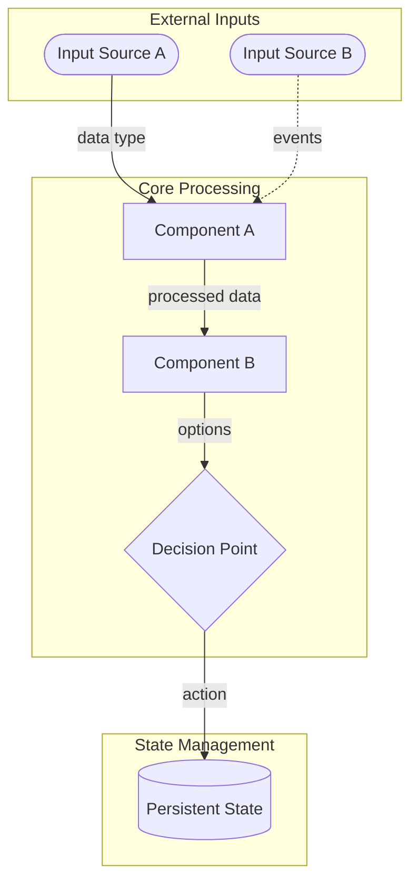

# Output Specification

---

## Overview

This document specifies the required format, structure, and content for deliverables produced in response to the Invention Design Brief. It ensures all solutions are presented in a consistent, evaluable format that maps directly to the Problem Statement, Objectives, Constraints, and Evaluation Criteria.

The deliverables serve two purposes: (1) to communicate the invented solution with sufficient clarity and detail for evaluation, and (2) to provide the foundation documents necessary to begin implementation if the solution is selected.

---

## Deliverable Structure

The complete solution submission consists of **five required deliverables**:

| # | Deliverable | Purpose |
|---|-------------|---------|
| 1 | Executive Summary | One-page overview for rapid assessment |
| 2 | Solution Design Document | Comprehensive solution specification |
| 3 | Foundation Documentation | First principles, secrets, and assumptions inventory |
| 4 | Constraint Compliance Statement | Explicit demonstration of constraint satisfaction |
| 5 | Run Log | Process documentation and assumption tracking |

All deliverables must be provided as markdown files or equivalent structured documents.

---

## Deliverable 1: Executive Summary

**Purpose:** Enable rapid initial assessment of solution viability.

**Length:** Maximum 1 page (approximately 500 words)

**Required Sections:**

### 1.1 Solution Name
- A concise, descriptive name for the solution

### 1.2 One-Sentence Summary
- A single sentence capturing the essence of the solution

### 1.3 Problem Addressed
- Brief statement of which aspects of the Problem Statement this solution addresses
- Reference to the three irreducible pains (loss of capital, cognitive requirement, forgone returns)

### 1.4 Core Mechanism
- 2-3 sentences describing how the solution works at the highest level
- The "how" of the solution, not just the "what"

### 1.5 Key Innovation
- What makes this solution different from existing approaches
- The primary source of structural advantage

### 1.6 Critical Dependencies
- The 2-3 most important assumptions or conditions required for success
- What must be true for this solution to work

### 1.7 Expected Outcomes
- Qualitative statement of expected performance against the three pains
- How the solution addresses capital preservation, return competitiveness, and cognitive efficiency

---

## Deliverable 2: Solution Design Document

**Purpose:** Comprehensive specification of the solution sufficient for evaluation and implementation planning.

**Length:** No minimum or maximum; completeness and clarity over brevity

**Required Sections:**

### 2.1 Solution Overview

#### 2.1.1 Problem Restatement
- Restate the problem being solved (may refine per Problem Statement Treatment setting)
- Identify which root causes from the Problem Statement the solution addresses
- Acknowledge which aspects of the problem remain unaddressed, if any

#### 2.1.2 Solution Architecture
- High-level description of the solution's structure and components
- Clear delineation of what is included vs. excluded from scope

**Required: Architecture Diagram in Mermaid Syntax**

An architecture diagram must be provided using Mermaid syntax following these conventions:

```
Mermaid Diagram Conventions:

LAYOUT
- Use `flowchart TB` for deep architectures; `flowchart LR` for wide/shallow ones
- Use `subgraph` for grouping related components (one level of nesting only)
- Keep diagrams focused; split large systems into multiple diagrams

NODE SHAPES
- `[Rectangle]` — processing components / agents
- `[(Database)]` — storage / persistence
- `([Rounded])` — external systems / APIs
- `{Diamond}` — decision points
- `[[Subroutine]]` — reusable modules

ARROWS
- `-->` — synchronous data flow
- `-.->` — asynchronous / event-driven flow
- Label all edges with data/signal names

NAMING
- Meaningful component IDs (e.g., `riskAgent` not `ra1`)
- Use `<br/>` for multi-line node labels
- Keep labels concise
```

**Example structure (illustrative only—actual diagram should reflect the invented solution):**


**Note:** The example above is generic. The actual diagram must reflect the specific architecture of the invented solution, whatever form it takes.

The diagram should clearly show:
- All major components and their relationships
- Data flows between components
- External dependencies
- Decision points
- Storage/persistence elements

#### 2.1.3 Operating Model
- How the solution functions in steady-state operation
- Who does what, when, and how
- Decision flows and information flows

### 2.2 Pain Point Resolution

**Requirement:** Explicitly address each of the three irreducible pains from Problem Statement §3.

#### 2.2.1 Capital Preservation (Addresses Pain Point §3.1)
For each loss vector identified in Problem Statement §3.1, document:
- How the solution addresses or mitigates this loss source
- Residual risk that remains after mitigation
- Whether the mitigation is structural (by design) or operational (by execution)

**Loss vectors to address:**
- Market-driven destruction (broad market declines, sector collapses)
- Security-driven destruction (position failures, single-holding risk)
- Forced crystallization (liquidity needs, margin calls)
- External shocks (geopolitical, regulatory, currency)
- Counterparty and system failures (broker, custodian, exchange, cyber)
- Erosion (inflation, fees exceeding returns)
- Behavioral self-destruction (panic selling, revenge trading, excessive leverage)

#### 2.2.2 Cognitive Efficiency (Addresses Pain Point §3.2)
Document the human cognitive load required:

| Category | Required Frequency | Estimated Time | Complexity |
|----------|-------------------|----------------|------------|
| Learning burden | | | |
| Analytical burden | | | |
| Decision burden | | | |
| Monitoring burden | | | |
| Evaluation burden | | | |
| Emotional burden | | | |

Include:
- Total estimated weekly/monthly time commitment
- Skill requirements and learning curve
- Emotional exposure assessment
- Sustainability assessment (can this be maintained for 10+ years?)

#### 2.2.3 Return Competitiveness (Addresses Pain Point §3.3)
For each forgone return source identified in Problem Statement §3.3, document:
- How the solution minimizes this source of underperformance
- Expected residual gap (qualitative assessment)
- The logical argument for why returns should converge on available returns over time

**Forgone return sources to address:**
- Selection gaps (asset choice, holdings quality)
- Timing gaps (entry, exit, holding period)
- Sizing gaps (position sizing relative to opportunity)
- Friction gaps (fees, taxes, transaction costs, cash drag)
- Behavioral gaps (chasing, panic selling, overtrading, herding)
- Information gaps (available information not utilized or misinterpreted)
- Structural gaps (diversification dilution, access constraints)

### 2.3 Objectives Alignment

**Requirement:** Demonstrate how the solution addresses each objective per its MoSCoW treatment level.

#### MUST Objectives (Non-negotiable; failure is disqualifying)

| Objective | Treatment | How Addressed | Evidence/Reasoning |
|-----------|-----------|---------------|-------------------|
| 1. Preserve capital first, then maximize returns | MUST | | |
| 2. Minimize forgone returns | MUST | | |
| 3. Build from first principles | MUST | | |
| 4. Incorporate secrets continuously | MUST | | |
| 5. Improve and adapt over time | MUST | | |
| 6. Minimize cognitive burden | MUST | | |

For each MUST objective:
- **How Addressed:** Specific mechanisms, design choices, or features that satisfy this objective
- **Evidence/Reasoning:** Why the evaluator should believe this objective will be met
- **Success Indicator Met:** Reference to the objective's success indicator and how the solution satisfies it

#### SHOULD Objectives (Important; solution could work without)

| Objective | Treatment | How Addressed | Trade-offs |
|-----------|-----------|---------------|------------|
| 7. Design something new and different | SHOULD | | |

For SHOULD objectives:
- **How Addressed:** Mechanisms that satisfy this objective, if present
- **Trade-offs:** If objective is not fully met, explain what was traded off and why

#### COULD Objectives (Nice-to-have; include if resources allow)

| Objective | Treatment | Included? | Notes |
|-----------|-----------|-----------|-------|
| 8. Prefer simplicity | COULD | | |
| 9. Prefer durability | COULD | | |
| 10. Accept human input | COULD | | |
| 11. Provide transparency | COULD | | |

For COULD objectives:
- **Included?:** Yes/Partial/No
- **Notes:** How addressed if included; why excluded if not

### 2.4 Mechanism Design

#### 2.4.1 Core Components
For each major component of the solution:
- **Name:** Component identifier
- **Purpose:** What problem this component solves
- **Mechanism:** How it works
- **Inputs:** What it requires
- **Outputs:** What it produces
- **Dependencies:** Other components it relies on
- **Complexity Justification:** Why this level of complexity is necessary (per Objective 8)

#### 2.4.2 Decision Logic
Document all significant decision points:
- **Decision:** What must be decided
- **Trigger:** When the decision is required
- **Inputs:** Information used to make the decision
- **Logic:** How the decision is made (rules, heuristics, algorithms)
- **Human vs. Automated:** Whether human judgment is required
- **Reversibility:** Can the decision be reversed if wrong?

#### 2.4.3 Risk Controls
Document all risk control mechanisms:
- **Risk:** What is being controlled
- **Mechanism:** How it is controlled
- **Trigger:** When the control activates
- **Fail-Safe:** What happens if the control fails

### 2.5 Failure Mode Analysis

#### 2.5.1 Identified Failure Modes
For each identified way the solution could fail:

| Failure Mode | Likelihood | Severity | Detection | Mitigation |
|--------------|------------|----------|-----------|------------|
| | High/Medium/Low | Catastrophic/Severe/Moderate/Minor | How would we know? | How is it prevented or contained? |

#### 2.5.2 Unmitigated Risks
Acknowledge risks that remain unmitigated:
- What they are
- Why they cannot be mitigated
- Under what conditions they would materialize
- What the consequences would be

#### 2.5.3 Inversion Analysis
Apply inversion: What would have to go wrong for the solution to fail catastrophically?
- List the conditions that would need to occur
- Assess likelihood of those conditions occurring together
- Identify any early warning signs

### 2.6 Implementation Considerations

#### 2.6.1 Resource Requirements
- **Team:** Skills, roles, headcount required
- **Technology:** Systems, platforms, tools required
- **Capital:** Minimum and optimal starting capital
- **Time:** Estimated implementation timeline

#### 2.6.2 Scaling Characteristics
- How does the solution perform at different capital levels?
- Are there capacity constraints?
- What changes as scale increases?

#### 2.6.3 Dependencies Inventory
List all external dependencies:

| Dependency | Type | Maturity | Alternatives | Single Point of Failure? |
|------------|------|----------|--------------|-------------------------|
| | Technology/Data/Service/Platform | Mature/Developing/Experimental | | Yes/No |

---

## Deliverable 3: Foundation Documentation

**Purpose:** Document the intellectual foundations that support the solution design, including explicit inventories of all inputs utilized from the Invention Design Brief.

### 3.1 Input Utilization Inventories

**Requirement:** Document all inputs from the Invention Design Brief that informed the solution. Each inventory must list the specific items used and how they influenced the design.

#### 3.1.1 First Principles Used

| ID | First Principle | Source | How Used in Solution |
|----|-----------------|--------|---------------------|
| FP-01 | [Statement] | [Source document/derivation] | [Specific design decisions or mechanisms informed] |

#### 3.1.2 Observations Used

| ID | Observation | Source (Investor/Document) | How Used in Solution |
|----|-------------|---------------------------|---------------------|
| OBS-01 | [Brief statement of observation] | [e.g., "Benjamin Graham, Observation 3"] | [Specific design decisions or mechanisms informed] |

#### 3.1.3 Secrets Used

| ID | Secret | Source | Defensibility | How Used in Solution |
|----|--------|--------|---------------|---------------------|
| SEC-01 | [Statement of the secret] | [Source] | [How long advantage persists] | [Specific design decisions or mechanisms informed] |

#### 3.1.4 Inventor's Toolkit Used

| ID | Tool/Method | Source | How Used in Solution |
|----|-------------|--------|---------------------|
| TK-01 | [Name of invention method or framework] | [Source document] | [How applied to generate or refine the solution] |

#### 3.1.5 Technologies Used

| ID | Technology | Category | Maturity | How Used in Solution |
|----|------------|----------|----------|---------------------|
| TECH-01 | [Technology name] | [e.g., Infrastructure/Data/Analysis] | [Mature/Developing/Experimental] | [Specific role in the solution] |

#### 3.1.6 Methodologies Used

| ID | Methodology | Source | How Used in Solution |
|----|-------------|--------|---------------------|
| METH-01 | [Methodology name] | [Source document] | [How applied in the solution design or operation] |

#### 3.1.7 Mental Models Used

| ID | Mental Model | Source | How Used in Solution |
|----|--------------|--------|---------------------|
| MM-01 | [Mental model name, e.g., "Inversion", "Second-order effects"] | [Source] | [How applied in reasoning or design] |

**Requirements for all inventories:**
- List only items actually used (not all available inputs)
- Provide specific, traceable connections to design decisions
- Cross-reference to relevant sections in the Solution Design Document where applicable

### 3.2 First Principles Analysis

**Purpose:** Provide deeper analysis of how first principles ground the solution design.

Beyond the inventory in §3.1.1, document:

| First Principle | Why It's Fundamental | Stability Assessment | Design Decisions Supported |
|-----------------|---------------------|---------------------|---------------------------|
| [Principle from inventory] | [Why this cannot be derived from other propositions] | [Why this will remain true over time] | [Specific design choices this supports] |

**Requirements:**
- Every major design decision must trace to at least one first principle
- Principles should be fundamental truths that remain stable over time
- Include reasoning for why each is considered a first principle (not derivable from other propositions)

### 3.3 Secrets Analysis

**Purpose:** Provide deeper analysis of the secrets that provide competitive advantage.

Beyond the inventory in §3.1.3, document:

| Secret | Why It's a Secret | Defensibility | Refresh Mechanism |
|--------|-------------------|---------------|-------------------|
| [Secret from inventory] | [Why this isn't widely known/believed/acted upon] | [How long this advantage persists] | [How new secrets will be discovered] |

**Requirements:**
- Explain why each qualifies as a secret (not widely known, believed, or acted upon)
- Assess defensibility: How long before this becomes common knowledge?
- Describe the mechanism for discovering new secrets as existing ones are exploited

### 3.4 Key Assumptions Inventory

List all significant assumptions the solution depends on:

| ID | Assumption | Criticality | Durability | Validation Approach |
|----|------------|-------------|------------|---------------------|
| A-01 | [Statement of the assumption] | High/Medium/Low | [Expected lifespan] | [How to test/validate] |

**Requirements:**
- Distinguish between assumptions that are testable vs. untestable
- Identify assumptions that, if wrong, would invalidate the solution
- Describe how assumptions will be monitored for continued validity

---

## Deliverable 4: Constraint Compliance Statement

**Purpose:** Explicitly demonstrate that the solution satisfies all constraints.

### 4.1 HARD Constraints (Non-negotiable)

#### Constraint 1: Team Scale
**Requirement:** Must be implementable by a startup of 5-10 people significantly augmented by AI

| Assessment | ☐ PASS | ☐ FAIL |
|------------|--------|--------|

**Evidence:**
- List required capabilities and skills
- Map each to team roles
- Identify which capabilities can be AI-augmented
- Explain how a team of 5-10 could implement and operate this solution

**Disqualification Risk:** Failure is disqualifying regardless of other scores.

#### Constraint 2: Public Information and Instruments
**Requirement:** Must use only publicly accessible information and instruments (including paid APIs)

| Assessment | ☐ PASS | ☐ FAIL |
|------------|--------|--------|

**Evidence:**
- Inventory all information sources with access method
- Inventory all instruments with where they can be traded
- Confirm no dependencies on insider information, privileged relationships, or proprietary data

**Disqualification Risk:** Failure is disqualifying regardless of other scores.

### 4.2 SOFT Constraints (Preferred; can be relaxed with justification)

#### Constraint 3: Crypto-Native
**Preference:** Solutions built on or around crypto/blockchain infrastructure and markets

| Score | 1 | 2 | 3 | 4 | 5 |
|-------|---|---|---|---|---|
| Assessment | ☐ | ☐ | ☐ | ☐ | ☐ |

**Evidence:**
- Describe crypto/blockchain elements of the solution
- Identify unique crypto properties being leveraged (24/7 markets, programmability, transparency, global access)
- If score < 3, document justification for relaxation and what crypto advantages are sacrificed

#### Constraint 4: Regulatory Environment
**Preference:** Less regulated markets where broader range of activities are permitted

| Score | 1 | 2 | 3 | 4 | 5 |
|-------|---|---|---|---|---|
| Assessment | ☐ | ☐ | ☐ | ☐ | ☐ |

**Evidence:**
- Describe regulatory exposure of the solution
- List any licensing or registration requirements
- If score < 3, document justification for relaxation and what solution space is sacrificed

#### Constraint 5: Capital Requirements
**Preference:** Achievable with moderate starting capital ($10,000–$1,000,000)

| Score | 1 | 2 | 3 | 4 | 5 |
|-------|---|---|---|---|---|
| Assessment | ☐ | ☐ | ☐ | ☐ | ☐ |

**Evidence:**
- Document minimum viable capital
- Describe functionality at different capital levels
- If score < 3, document how lower-capital participants might phase in

---

## Deliverable 5: Run Log

**Purpose:** Document the invention process for transparency and learning.

### 5.1 Process Summary
- Brief narrative of how the solution was developed
- Key decision points and how they were resolved
- Major alternatives considered and why they were rejected

### 5.2 Input Utilization

| Input | Requirement | Status | Notes |
|-------|-------------|--------|-------|
| Problem Statement | REQUIRED | Addressed/Partially Addressed | |
| Objectives | REQUIRED | Addressed/Partially Addressed | |
| Constraints | REQUIRED | Addressed/Partially Addressed | |
| Output Specification | REQUIRED | Followed | |
| Evaluation Criteria | REQUIRED | Addressed/Partially Addressed | |
| Reference Solutions | OPTIONAL | Used/Not Used | |
| Inventor's Toolkit | CONFIGURED | Used/Not Used | |
| First Principles | CONFIGURED | Used/Not Used | |
| Observations | CONFIGURED | Used/Not Used | |
| Secrets | CONFIGURED | Used/Not Used | |
| Technologies | CONFIGURED | Used/Not Used | |
| Methodologies | CONFIGURED | Used/Not Used | |
| Mental Models | CONFIGURED | Used/Not Used | |

### 5.3 Assumptions Log
List any assumptions made due to ambiguity in inputs:
- What was ambiguous
- What assumption was made
- Why that assumption was chosen

### 5.4 Missing Inputs
If any REQUIRED inputs were not provided:
- Which inputs were missing
- What reasonable assumptions were made to proceed
- How confidence is affected by the missing inputs

### 5.5 Problem Statement Refinements
If Problem Statement Treatment was DIRECTIONAL or EXPLORATORY:
- What refinements or reframings were made
- Why they were warranted
- How they remain anchored to the original problem

---

## Format and Style Requirements

### Document Format
- All deliverables in markdown format
- Use consistent heading hierarchy
- Tables for structured data where appropriate
- Clear section numbering for cross-referencing

### Writing Standards
- Clear, precise language
- Assertions supported by reasoning or evidence
- Ambiguity acknowledged explicitly
- Technical terms defined on first use

### Completeness Standards
- All required sections present
- All MUST objectives explicitly addressed
- All HARD constraints explicitly assessed as PASS/FAIL
- All significant design decisions traceable to principles or reasoning

### Quality Standards
- Internal consistency (no contradictions between sections)
- External consistency (alignment with Problem Statement, Objectives, Constraints)
- Actionable (sufficient detail for implementation planning)
- Evaluable (sufficient detail for assessment against Evaluation Criteria)

---

## Evaluation Mapping

This section maps deliverable content to Evaluation Criteria sections to ensure completeness.

| Evaluation Criterion | Primary Deliverable | Sections |
|---------------------|---------------------|----------|
| 1.1 Capital Preservation | Design Document | §2.2.1, §2.5 |
| 1.2 Return Competitiveness | Design Document | §2.2.3 |
| 1.3 Human Cognitive Efficiency | Design Document | §2.2.2 |
| 2.1 First Principles Foundation | Foundation Documentation | §3.1.1, §3.2 |
| 2.2 Secrets Integration | Foundation Documentation | §3.1.3, §3.3 |
| 2.3 Adaptability | Design Document | §2.3 (Objective 5) |
| 3.1 Innovation | Design Document | §2.3 (Objective 7), Executive Summary §1.5 |
| 3.2 Simplicity | Design Document | §2.4.1 (Complexity Justification) |
| 3.3 Durability | Design Document | §2.6.3 (Dependencies), Foundation Documentation §3.4 |
| 3.4 Human Input Capacity | Design Document | §2.3 (Objective 10) |
| 3.5 Transparency | Design Document | §2.3 (Objective 11) |
| 4.1 Team Scale (HARD) | Constraint Compliance | §4.1 (Constraint 1) |
| 4.2 Public Information (HARD) | Constraint Compliance | §4.1 (Constraint 2) |
| 4.3 Crypto-Native | Constraint Compliance | §4.2 (Constraint 3) |
| 4.4 Regulatory Environment | Constraint Compliance | §4.2 (Constraint 4) |
| 4.5 Capital Requirements | Constraint Compliance | §4.2 (Constraint 5) |

---

## Appendix A: Checklist for Completeness

Before submission, verify:

### Executive Summary
- [ ] Solution name provided
- [ ] One-sentence summary provided
- [ ] Problem addressed clearly stated
- [ ] Core mechanism explained
- [ ] Key innovation identified
- [ ] Critical dependencies listed
- [ ] Expected outcomes stated

### Solution Design Document
- [ ] Problem restated (with refinements if applicable)
- [ ] Solution architecture described
- [ ] **Architecture diagram provided in Mermaid syntax**
- [ ] Operating model explained
- [ ] All loss vectors from §3.1 addressed
- [ ] Cognitive load estimated
- [ ] All forgone return sources from §3.3 addressed
- [ ] All MUST objectives explicitly addressed
- [ ] SHOULD and COULD objectives addressed or acknowledged
- [ ] Core components documented
- [ ] Decision logic documented
- [ ] Risk controls documented
- [ ] Failure modes analyzed
- [ ] Unmitigated risks acknowledged
- [ ] Resource requirements specified
- [ ] Dependencies inventoried

### Foundation Documentation
**Input Utilization Inventories (§3.1)**
- [ ] First principles used inventory complete
- [ ] Observations used inventory complete
- [ ] Secrets used inventory complete
- [ ] Inventor's toolkit used inventory complete
- [ ] Technologies used inventory complete
- [ ] Methodologies used inventory complete
- [ ] Mental models used inventory complete
- [ ] All inventory items traced to specific design decisions

**Analysis Sections (§3.2–3.4)**
- [ ] First principles analysis complete
- [ ] Design decisions traced to principles
- [ ] Secrets analysis complete
- [ ] Defensibility and refresh mechanisms documented
- [ ] Key assumptions inventory complete
- [ ] Assumption criticality and durability assessed

### Constraint Compliance Statement
- [ ] Constraint 1 (Team Scale) assessed PASS/FAIL with evidence
- [ ] Constraint 2 (Public Information) assessed PASS/FAIL with evidence
- [ ] Constraint 3 (Crypto-Native) scored 1-5 with evidence
- [ ] Constraint 4 (Regulatory) scored 1-5 with evidence
- [ ] Constraint 5 (Capital) scored 1-5 with evidence
- [ ] Relaxation justifications provided for any SOFT constraint < 3

### Run Log
- [ ] Process summary provided
- [ ] Input utilization documented
- [ ] Assumptions logged
- [ ] Missing inputs documented (if any)
- [ ] Problem statement refinements documented (if any)

---

## Appendix B: Mermaid Diagram Conventions

Architecture diagrams must follow these conventions:

### Layout
- `flowchart TB` for deep architectures; `flowchart LR` for wide/shallow ones
- `subgraph` for grouping related components (one level of nesting only)
- Keep diagrams focused; split large systems into multiple diagrams

### Node Shapes
| Shape | Syntax | Use For |
|-------|--------|---------|
| Rectangle | `[Label]` | Processing components / agents |
| Database | `[(Label)]` | Storage / persistence |
| Rounded | `([Label])` | External systems / APIs |
| Diamond | `{Label}` | Decision points |
| Subroutine | `[[Label]]` | Reusable modules |

### Arrows
| Arrow | Syntax | Use For |
|-------|--------|---------|
| Solid | `-->` | Synchronous data flow |
| Dashed | `-.->` | Asynchronous / event-driven flow |

**Requirement:** Label all edges with data/signal names

### Naming
- Use meaningful component IDs (e.g., `riskAgent` not `ra1`)
- Use `<br/>` for multi-line node labels
- Keep labels concise

---

## Appendix C: Glossary

| Term | Definition |
|------|------------|
| **First Principle** | A fundamental truth or proposition that serves as the foundation for reasoning; cannot be deduced from other propositions |
| **Secret** | A non-obvious truth that is not widely known, believed, or acted upon; provides competitive advantage |
| **HARD Constraint** | A non-negotiable boundary; violation is disqualifying |
| **SOFT Constraint** | A preferred condition that can be relaxed with justification |
| **MUST Objective** | A non-negotiable goal; the solution fails without it |
| **SHOULD Objective** | An important goal; solution could work without it |
| **COULD Objective** | A nice-to-have goal; include if resources allow |
| **Pain Point** | One of the three irreducible sources of investment difficulty: loss of capital, cognitive requirement, forgone returns |
| **Loss Vector** | A specific source or mechanism of capital loss |
| **Forgone Return Source** | A specific source or mechanism of underperformance relative to available alternatives |

---

## Version History

| Version | Date | Changes |
|---------|------|---------|
| 1.0 | 2025 | Initial specification |
