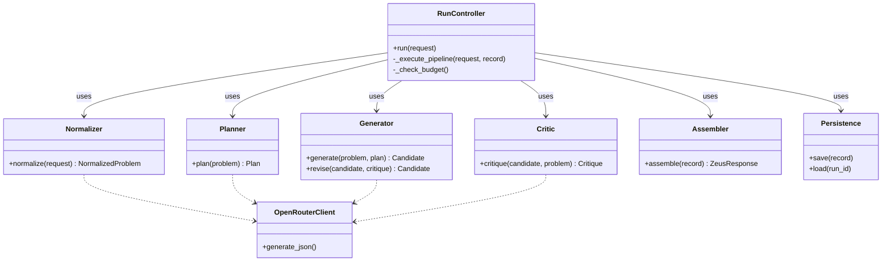
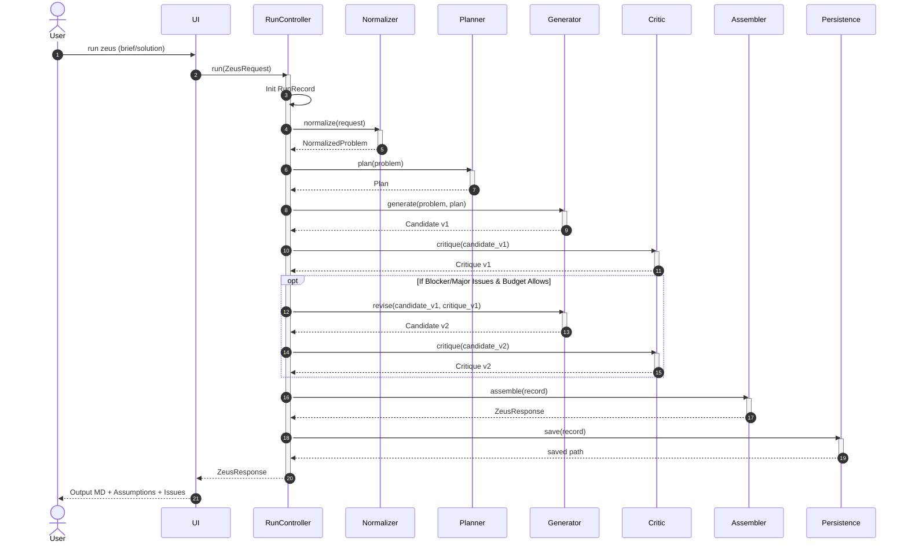

# Zeus V0 Architecture and Design

**Version:** 0.3 (Implemented)  
**Date:** 2026-01-30  

This document describes the implemented architecture for Zeus V0 (Bounded Critique-Led Solver).

---

## 1. Component Architecture

Zeus V0 follows a modular controller-based architecture. The `RunController` acts as the central orchestrator, managing the lifecycle of a request by delegating to specialized stateless components.

### Component Roles

1.  **RunController (`core/run_controller.py`)**:
    *   **Responsibility**: Orchestrates the workflow, enforces budgets (LLM calls, timeouts), manages state (RunRecord), and ensures invariants (e.g., critique always runs).
    *   **Key Invariants**: Max 1 revision loop, traceability of all runs.

2.  **Normalizer (`core/normalizer.py`)**:
    *   **Responsibility**: Converts raw user input (`ZeusRequest`) into a structured `NormalizedProblem`.
    *   **Key Logic**: Ensures constraints are never dropped, merges user and implied constraints.

3.  **Planner (`core/planner.py`)**:
    *   **Responsibility**: Decomposes the problem into a linear sequence of steps (`Plan`).
    *   **Key Logic**: Generates distinct steps for analysis, generation, and verification.

4.  **Generator (`core/generator.py`)**:
    *   **Responsibility**: Produces the actual content (`Candidate`) based on the plan.
    *   **Key Logic**: Supports both initial generation and revision based on critique.

5.  **Critic (`core/critic.py`)**:
    *   **Responsibility**: provides multi-view feedback (`Critique`).
    *   **Key Logic**: Enforces coverage of 6 key perspectives (scope, architecture, risk, security, compliance, evaluation) in a single LLM call.

6.  **Assembler (`core/assembler.py`)**:
    *   **Responsibility**: Formats the final output (`ZeusResponse`).
    *   **Key Logic**: Calculates costs/usage and ensures `assumptions` and `known_issues` are always present.

7.  **Persistence (`core/persistence.py`)**:
    *   **Responsibility**: Handles disk I/O for `RunRecords`.
    *   **Key Logic**: Append-only JSON storage.

---

## 2. Sequence Diagram (Run Lifecycle)

This sequence diagram illustrates the execution flow within `RunController.run()`.

